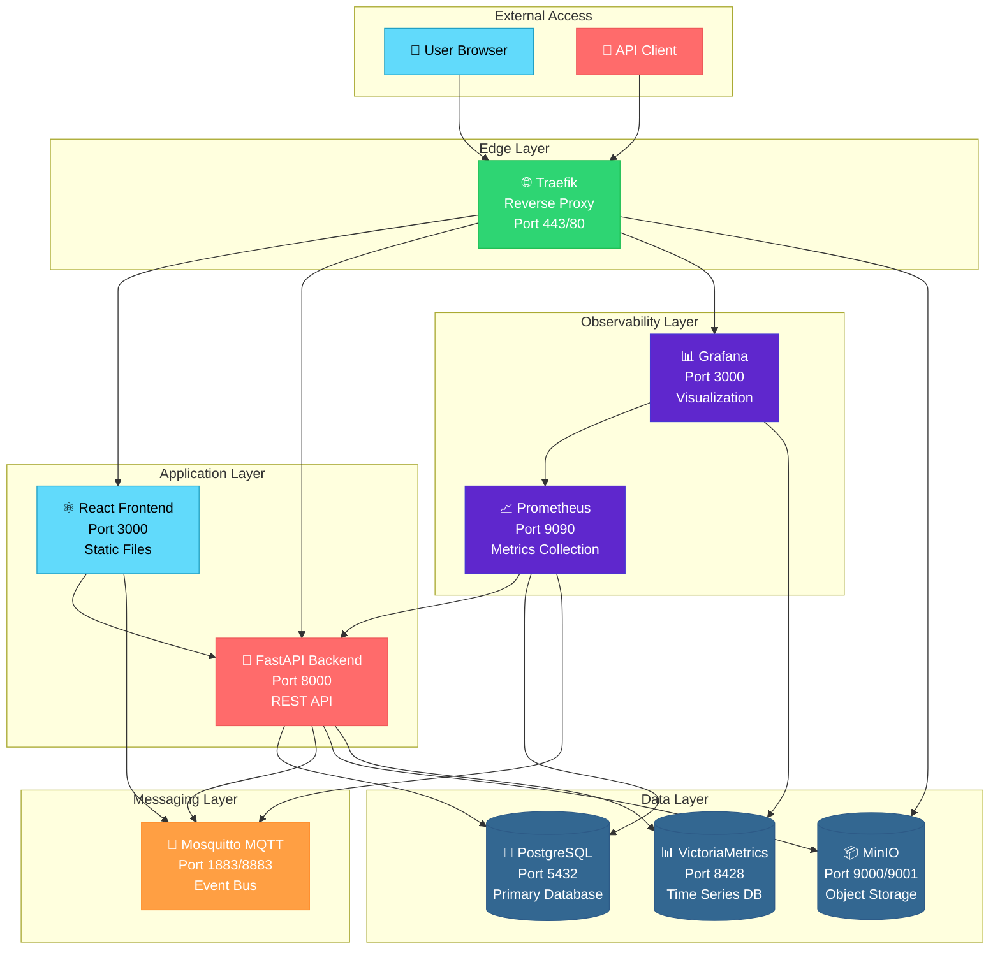
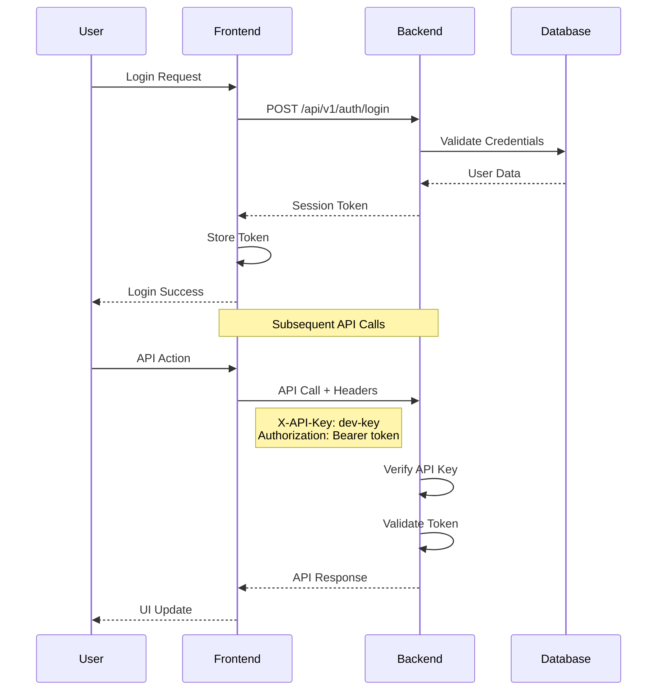
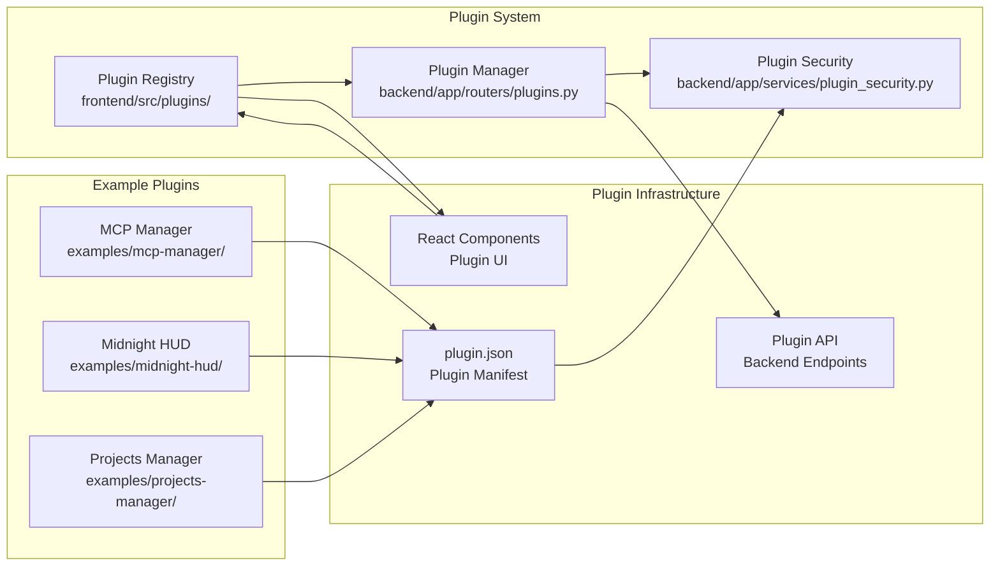
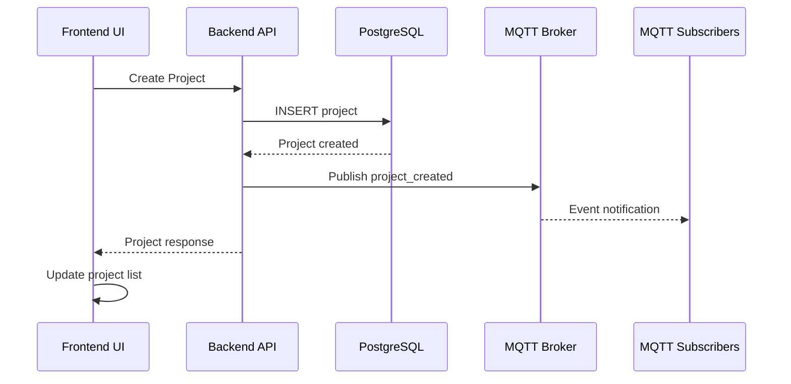
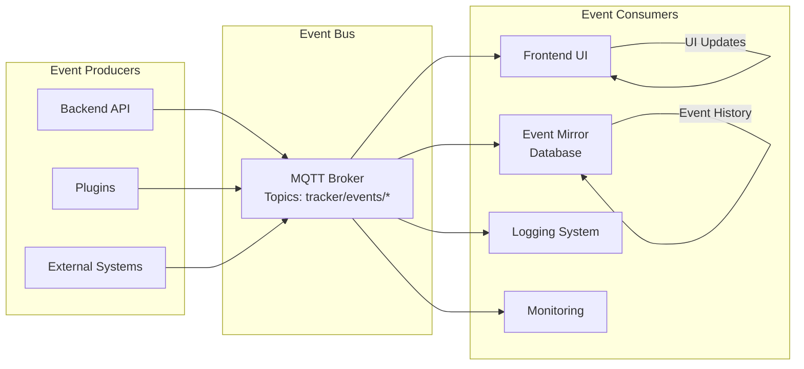

# Integration Map

## 🌐 Service Architecture Overview



## 🔗 Detailed Integration Patterns

### Frontend → Backend (HTTP API)

**Protocol**: HTTP/HTTPS
**Authentication**: API Key + Optional Bearer Token
**Content**: JSON REST API

```typescript
// Frontend API Client
const headers: HeadersInit = {
  'Content-Type': 'application/json',
  'X-API-Key': 'taylordash-dev-key',
  'Authorization': `Bearer ${sessionToken}` // Optional
};

const response = await fetch('/api/v1/projects', {
  method: 'GET',
  headers
});
```

**Key Integration Points**:
- `frontend/src/services/api.ts` → `backend/app/main.py`
- Authentication: `frontend/src/contexts/AuthContext.tsx` → `backend/app/security.py`
- Error handling: `frontend/src/utils/errorHandling.ts` → Backend HTTP status codes

### Backend → Database (PostgreSQL)

**Protocol**: PostgreSQL Wire Protocol
**Authentication**: Username/Password
**Connection**: Connection Pool (asyncpg)

```python
# Backend Database Access
pool = await get_db_pool()
async with pool.acquire() as conn:
    rows = await conn.fetch("SELECT * FROM projects")
    return [dict(row) for row in rows]
```

**Key Integration Points**:
- Connection: `backend/app/database.py` → PostgreSQL service
- Models: `backend/app/models/` → Database schema
- Schema: `infra/postgres/init.sql` → Database initialization

### Backend → MQTT (Event Publishing)

**Protocol**: MQTT over TCP
**Authentication**: Username/Password (taylordash/taylordash)
**Topics**: `tracker/events/*` namespace

```python
# Backend MQTT Publishing
mqtt_processor = await get_mqtt_processor()
await mqtt_processor.publish_event(
    topic="tracker/events/projects/created",
    kind="project_created",
    payload={"project_id": project_id, "name": name}
)
```

**Key Integration Points**:
- Publisher: `backend/app/mqtt_client.py` → Mosquitto broker
- Event schemas: `backend/app/schemas.py` → MQTT message format
- Configuration: `infra/mosquitto/mosquitto.conf` → Broker settings

### Frontend → MQTT (Real-time Updates)

**Protocol**: WebSocket (MQTT over WebSocket)
**Authentication**: Username/Password
**Port**: 9001 (WebSocket), 1883 (TCP)

```typescript
// Frontend MQTT Subscription
mqttService.subscribe('tracker/events/projects/#', (topic, message) => {
  console.log('Project event received:', topic, message);
  // Update local state
});
```

**Key Integration Points**:
- Client: `frontend/src/services/mqttService.ts` → Mosquitto WebSocket
- Event bus: `frontend/src/services/eventBus.ts` → Internal event routing
- UI updates: React components → MQTT event handlers

### Backend → Object Storage (MinIO)

**Protocol**: S3-compatible HTTP API
**Authentication**: Access Key/Secret Key
**Usage**: File uploads, document storage, session briefs

```python
# Backend MinIO Integration
from minio import Minio

client = Minio(
    "minio:9000",
    access_key="taylordash",
    secret_key="taylordash123",
    secure=False
)

# Store session brief
client.put_object("sessions", "brief.json", brief_data)
```

**Key Integration Points**:
- Configuration: `docker-compose.yml` → MinIO service
- Access: Backend API endpoints → MinIO client
- Web UI: Traefik routing → MinIO console (port 9001)

## 📊 Observability Integration

### Prometheus → Services (Metrics Collection)

**Protocol**: HTTP (scraping)
**Format**: Prometheus text format
**Endpoints**: `/metrics` on each service

```yaml
# Prometheus Configuration
scrape_configs:
  - job_name: 'taylordash-backend'
    static_configs:
      - targets: ['backend:8000']
    metrics_path: '/metrics'
    scrape_interval: 30s
```

**Key Integration Points**:
- Backend metrics: `backend/app/main.py` → Prometheus client
- Database metrics: PostgreSQL exporter → Prometheus
- Configuration: `infra/prometheus/prometheus.yml`

### Grafana → Data Sources

**Backend Data Sources**:
- Prometheus (metrics)
- VictoriaMetrics (time-series)
- PostgreSQL (application data)

**Key Integration Points**:
- Configuration: `infra/grafana/provisioning/`
- Dashboards: Pre-configured JSON dashboard definitions
- Authentication: Admin user (admin/admin default)

## 🔐 Security Integration

### Traefik → Services (Reverse Proxy)

**Features**:
- TLS termination
- HTTP to HTTPS redirect
- Security headers
- Service routing

```yaml
# Traefik Labels (docker-compose.yml)
labels:
  - "traefik.enable=true"
  - "traefik.http.routers.backend.rule=Host(`taylordash.local`) && PathPrefix(`/api`)"
  - "traefik.http.services.backend.loadbalancer.server.port=8000"
```

**Key Integration Points**:
- Configuration: `infra/traefik/` → Dynamic configuration
- Certificates: `certs/` → TLS certificate storage
- Routing: Service labels → Traefik routes

### Authentication Flow



## 🔌 Plugin Integration

### Plugin Architecture



**Key Integration Points**:
- Registration: `frontend/src/plugins/registry.ts`
- Security validation: `backend/app/services/plugin_security.py`
- API endpoints: `backend/app/routers/plugins.py`
- Plugin manifests: `examples/*/plugin.json`

## 🗂️ Data Flow Patterns

### Project Management Flow



### Real-time Event Flow



## 🤖 For AI Agents

### Quick Context
This map shows how all TaylorDash services integrate and communicate. Use it to understand data flow, find integration points, and troubleshoot cross-service issues.

### Your Tools
- **Pattern**: Follow the integration patterns shown in code examples
- **Debugging**: Use the service connections to trace issues
- **Command**: `docker compose ps` (check service connectivity)
- **Command**: `docker compose logs <service>` (check integration logs)

### Common Pitfalls
- ⚠️ Missing authentication headers in service calls
- ⚠️ Wrong service hostnames in Docker network
- ⚠️ CORS issues between frontend and backend
- ⚠️ MQTT credential mismatches
- ⚠️ Database connection pool exhaustion

### Success Criteria
- ✅ All services can communicate according to the map
- ✅ Data flows correctly through the integration points
- ✅ Authentication works across all service boundaries
- ✅ Real-time updates propagate via MQTT
- ✅ Observability data is collected and displayed
- ✅ Plugin system integrates with core services