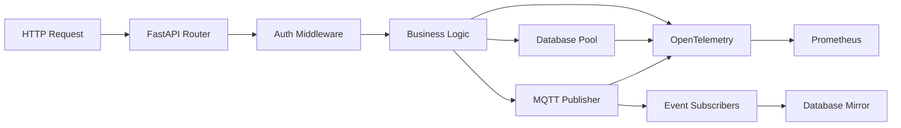

# TaylorDash Backend Architecture

## 🎯 Purpose
FastAPI-based backend implementing a **secure, event-driven, add-only architecture** for extensible plugin systems, real-time data processing, and comprehensive API services.

## 🏗️ Architecture & Design

### Design Patterns

#### **1. Dependency Injection Pattern**
- **Implementation**: FastAPI's dependency system for database, MQTT, auth
- **Benefits**: Clean separation of concerns, testability, resource lifecycle management
- **Usage**: Database connections, MQTT clients, authentication providers injected per request
- **Example**: `Depends(get_db_pool)` provides database connection pooling

#### **2. Repository Pattern**
- **Implementation**: Database abstraction layer with async connection pooling
- **Benefits**: Database independence, transaction management, query optimization
- **Location**: `database.py` with AsyncPG connection pooling
- **Connection Strategy**: Persistent pool with health checks and automatic reconnection

#### **3. Event-Driven Architecture**
- **Implementation**: MQTT message bus for asynchronous communication
- **Benefits**: Loose coupling, horizontal scalability, offline resilience
- **Message Schema**: All events include `trace_id` for distributed tracing
- **Event Mirroring**: All MQTT events persisted to PostgreSQL for audit trails

#### **4. Plugin Security Architecture**
- **Implementation**: Sandboxed plugin execution with security validation
- **Benefits**: Safe extensibility without compromising core system
- **Security Model**: Input validation, output sanitization, resource limits
- **Isolation**: Plugin processes run with restricted permissions

#### **5. Async/Await Pattern**
- **Implementation**: Full async/await throughout the application stack
- **Benefits**: High concurrency, non-blocking I/O, efficient resource utilization
- **Error Handling**: Proper exception boundaries with structured error responses
- **Resource Management**: Automatic cleanup in finally blocks

### Key Decisions

#### **FastAPI over Django/Flask**
- **Rationale**: Automatic OpenAPI documentation + async performance + type safety
- **Trade-offs**: Smaller ecosystem but better performance and modern Python features
- **Impact**: Self-documenting APIs and native async support throughout

#### **AsyncPG over SQLAlchemy**
- **Rationale**: Lower overhead, native PostgreSQL features, better async performance
- **Trade-offs**: Less abstraction but better control and performance
- **Impact**: Direct SQL with excellent connection pooling and transaction management

#### **MQTT over HTTP/WebSockets**
- **Rationale**: Lightweight pub/sub, offline resilience, QoS guarantees
- **Trade-offs**: Additional infrastructure but better event handling
- **Impact**: Decoupled services and reliable event delivery

#### **OpenTelemetry Integration**
- **Rationale**: Vendor-neutral observability with automatic instrumentation
- **Trade-offs**: Slight overhead but comprehensive tracing and metrics
- **Impact**: End-to-end request tracing and performance monitoring

### Integration Points

#### **Database → API**
- **Protocol**: AsyncPG connection pool
- **Data Format**: PostgreSQL native types + JSON for flexible schema
- **Transaction Management**: Explicit boundaries with proper rollback handling
- **Schema Evolution**: Migration-based with backward compatibility

#### **MQTT → Database**
- **Protocol**: Event mirroring pattern
- **Data Format**: JSON events with schema validation
- **Reliability**: At-least-once delivery with deduplication
- **Tracing**: Correlation IDs for end-to-end tracking

#### **API → Frontend**
- **Protocol**: RESTful HTTP with OpenAPI specification
- **Authentication**: Bearer tokens + API key dual validation
- **CORS**: Configured for specific frontend origins
- **Error Handling**: Structured error responses with helpful messages

#### **Plugin System → Core**
- **Protocol**: Secure API proxying with validation
- **Security**: Input sanitization and output filtering
- **Resource Limits**: Memory and CPU constraints
- **Communication**: Restricted API surface with explicit permissions

### Data Flow

### Performance Considerations

#### **Database Optimization**
- **Connection Pooling**: Min 5, Max 20 connections with health checks
- **Query Performance**: Indexed foreign keys and prepared statements
- **Transaction Scope**: Minimal transaction duration to reduce locks
- **Read Patterns**: Optimized for typical plugin and project queries

#### **Memory Management**
- **Async Context**: Proper cleanup of database connections and MQTT clients
- **Plugin Isolation**: Memory limits per plugin to prevent resource exhaustion
- **Caching Strategy**: Connection pooling acts as implicit cache
- **GC Optimization**: Async patterns reduce object creation overhead

#### **Concurrency Patterns**
- **Non-blocking I/O**: All database and MQTT operations are async
- **Backpressure Handling**: MQTT QoS settings and connection limits
- **Error Isolation**: Plugin failures don't affect core system
- **Resource Fairness**: Fair scheduling across concurrent requests

### Security Model

#### **Authentication Architecture**
- **Token Validation**: JWT tokens validated with Keycloak
- **Session Management**: Short-lived tokens with secure refresh patterns
- **API Key Authentication**: Secondary authentication for service-to-service
- **RBAC Integration**: Role-based access control with granular permissions

#### **Plugin Security Framework**
- **Input Validation**: Pydantic models with strict type checking
- **Output Sanitization**: Response filtering based on user permissions
- **Resource Limits**: CPU and memory constraints per plugin
- **API Surface**: Restricted to explicitly allowed endpoints

#### **Network Security**
- **TLS Everywhere**: All internal communication encrypted
- **CORS Policy**: Strict origin checking for browser requests
- **Rate Limiting**: Per-endpoint and per-user rate limits
- **Error Handling**: No sensitive information in error responses

#### **Data Protection**
- **SQL Injection Prevention**: Parameterized queries only
- **XSS Protection**: Response sanitization and CSP headers
- **CSRF Protection**: Token-based request validation
- **Audit Logging**: All security events logged to MQTT

## 📁 Architecture Components

### Core Modules

#### **`main.py` - Application Bootstrap**
- **Purpose**: FastAPI application factory with middleware chain
- **Patterns**: Dependency injection setup, plugin registration, health checks
- **Responsibilities**: CORS, security headers, OpenTelemetry instrumentation
- **Extension Points**: Router registration, middleware chain modification

#### **`database.py` - Data Layer**
- **Purpose**: Database connection management and query utilities
- **Patterns**: Connection pooling, transaction management, health monitoring
- **Responsibilities**: Schema management, connection lifecycle, query optimization
- **Extension Points**: New connection pools, custom query builders

#### **`mqtt_client.py` - Event Bus**
- **Purpose**: MQTT client with reconnection and event mirroring
- **Patterns**: Publisher/subscriber, dead letter queue, circuit breaker
- **Responsibilities**: Event publishing, subscription management, error handling
- **Extension Points**: New event types, custom message handlers

#### **`security.py` - Authentication**
- **Purpose**: Authentication and authorization utilities
- **Patterns**: Middleware chain, token validation, RBAC enforcement
- **Responsibilities**: JWT validation, role checking, security headers
- **Extension Points**: New auth providers, custom permissions

### Directory Structure

#### **`app/routers/` - API Endpoints**
- **auth.py**: Authentication and session management
- **plugins.py**: Plugin lifecycle and security management
- **mcp.py**: MCP (Model Context Protocol) integration
- **Pattern**: RESTful resource-based routing with OpenAPI documentation

#### **`app/models/` - Data Models**
- **plugin.py**: Plugin metadata and security models
- **Pattern**: Pydantic models with validation and serialization

#### **`app/services/` - Business Logic**
- **plugin_security.py**: Plugin security validation and sandboxing
- **plugin_installer.py**: Plugin installation and management
- **Pattern**: Service layer with dependency injection

#### **`app/database/` - Schema Management**
- **plugin_schema.sql**: Plugin database schema
- **Pattern**: Migration-based schema evolution

## 🔧 Development Workflow

### Common Tasks
- **Start development server**: `uvicorn app.main:app --reload --host 0.0.0.0 --port 8000`
- **Run tests**: `pytest tests/ -v --tb=short`
- **Install dependencies**: `pip install -e .`
- **Database migrations**: Apply SQL files in `app/database_migrations/`
- **Plugin management**: Use API endpoints in `app/routers/plugins.py`
- **Monitor logs**: Structured logging with trace correlation

### Testing Strategy
- **Unit Tests**: Individual component testing with mocking
- **Integration Tests**: End-to-end API testing with test database
- **Security Tests**: Plugin sandboxing and permission validation
- **Performance Tests**: Load testing with concurrent requests

### Error Handling Patterns
- **Structured Exceptions**: Custom exception classes with error codes
- **Graceful Degradation**: Fallback mechanisms for service failures
- **Audit Logging**: All errors logged to MQTT for centralized monitoring
- **User-Friendly Messages**: No sensitive information in client responses

## 🔗 Integration Architecture

### Dependencies
- **PostgreSQL**: Primary data store with ACID transactions
- **Mosquitto MQTT**: Event bus for real-time communication
- **Keycloak**: OIDC provider for authentication and authorization
- **Prometheus**: Metrics collection and alerting

### Service Interfaces
- **Frontend**: RESTful APIs with OpenAPI specification
- **Plugins**: Controlled API surface with security validation
- **External Services**: Event-driven integration via MQTT
- **Monitoring**: OpenTelemetry traces and Prometheus metrics

### Configuration Management
- **Environment Variables**: Database URLs, MQTT credentials, security keys
- **Feature Flags**: Plugin system enable/disable, debug modes
- **Resource Limits**: Connection pool sizes, plugin constraints
- **Security Settings**: Token expiration, rate limits, CORS origins

## 💡 Extension Guidelines for AI Agents

### Adding New Features
1. **Follow Add-Only Philosophy**: Create new modules rather than modifying existing ones
2. **Use Dependency Injection**: Register new services in the DI container
3. **Implement Security First**: All new endpoints require authentication/authorization
4. **Add Observability**: Include OpenTelemetry spans and Prometheus metrics
5. **Write Tests**: Unit and integration tests for all new functionality

### Plugin Development
1. **Security Validation**: All plugin inputs must be validated and sanitized
2. **Resource Limits**: Implement CPU and memory constraints
3. **Error Isolation**: Plugin failures should not affect core system
4. **API Documentation**: OpenAPI schemas for all plugin endpoints

### Database Operations
1. **Use Connection Pool**: Always use `Depends(get_db_pool)` for database access
2. **Transaction Management**: Explicit transaction boundaries with proper cleanup
3. **Query Optimization**: Index new columns and use prepared statements
4. **Schema Migrations**: Version-controlled schema changes

### Event Integration
1. **MQTT Publishing**: Use structured event schemas with trace IDs
2. **Event Mirroring**: All events should be persisted to database
3. **Error Handling**: Implement dead letter queues for failed events
4. **Subscription Management**: Clean up subscriptions on shutdown

## ⚠️ Critical Considerations

### Security Requirements
- **Never trust plugin input**: All data must be validated and sanitized
- **Resource isolation**: Plugins run with strict CPU and memory limits
- **Audit everything**: All security events logged to MQTT
- **Principle of least privilege**: Minimal API surface for plugins

### Performance Guidelines
- **Async everywhere**: Use async/await for all I/O operations
- **Connection pooling**: Reuse database connections efficiently
- **Error boundaries**: Prevent cascading failures
- **Resource monitoring**: Track CPU, memory, and connection usage

### Operational Excellence
- **Health checks**: Deep validation of all service dependencies
- **Graceful shutdown**: Proper cleanup of connections and resources
- **Monitoring integration**: OpenTelemetry traces and Prometheus metrics
- **Documentation**: Keep API documentation current with OpenAPI