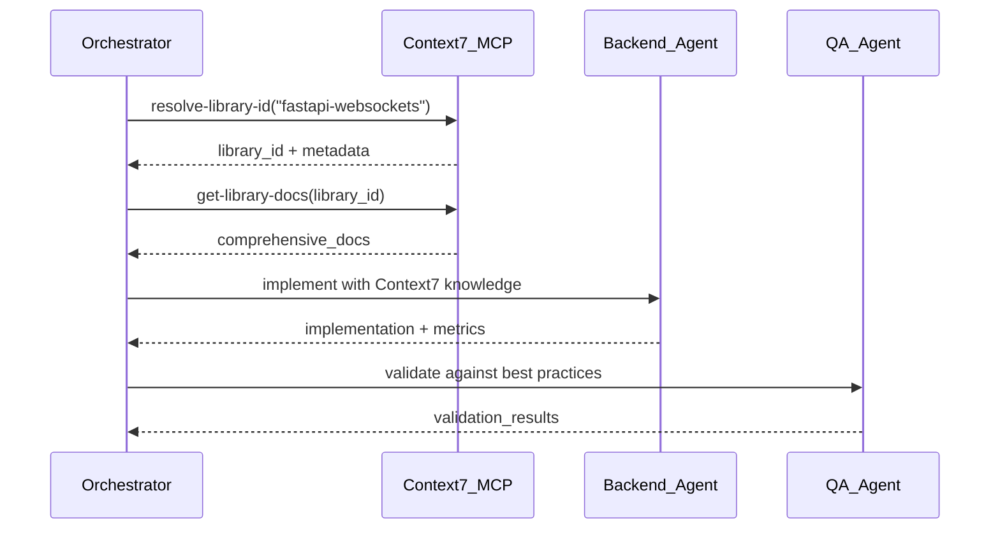

# Agent Orchestration Patterns

## Overview

Proven parallel agent strategies for the TaylorDash Master AI Brains system. These patterns enable efficient coordination of specialist agents with measurable outcomes and conflict resolution.

## Core Orchestration Patterns

### 1. Hierarchical Delegation Pattern

**Pattern**: Primary Orchestrator → Project Manager → Specialist Agents → QA/Validation → Documentation

**Success Metrics**:
- Task completion rate: >95%
- Context switching overhead: <10% of total time
- Agent idle time: <5%

**Implementation** (TaylorDash Agents):
```yaml
orchestration_flow:
  entry: "TaylorDash Orchestrator"
  policies:
    add_only: true
    docs_required: true
    trace_required: true
  stages:
    - stage: "planning"
      agent: "project_manager"
      tools: ["planner", "adr_writer"]
      rbac: ["admin"]
      inputs: ["snapshot", "backlog", "failures"]
      outputs: ["session_plan", "acceptance_criteria"]
    - stage: "execution"
      parallel: true
      agents:
        - name: "backend_dev"
          tools: ["fastapi_gen", "mqtt_client", "tsdb_adapter", "minio_client"]
          rbac: ["admin", "maintainer"]
        - name: "architecture_contracts"
          tools: ["openapi_gen", "jsonschema_lint"]
          rbac: ["admin", "maintainer"]
        - name: "observability"
          tools: ["otel_instrument", "prom_rules", "grafana_panels"]
          rbac: ["admin", "maintainer"]
      coordination: "event_driven"
    - stage: "validation"
      agent: "qa_tests"
      tools: ["pytest_asyncio", "bash_runner"]
      rbac: ["admin", "maintainer"]
      gates: ["contract_compliance", "security_check", "observability_check"]
    - stage: "documentation"
      agent: "scribe_docs"
      tools: ["mkdocs_writer", "adr_manager", "minio_uploader"]
      rbac: ["admin", "maintainer", "viewer"]
      final: true
```

**Failure Modes & Prevention**:
- **Context Loss**: Persist agent state to `agents.json` after each stage
- **Circular Dependencies**: Use topological sorting in task graph
- **Resource Contention**: Implement agent resource pooling

### 2. Event-Driven Coordination Pattern

**Pattern**: MQTT-based agent communication with trace correlation

**Success Metrics**:
- Message delivery rate: 99.9%
- End-to-end trace correlation: 100%
- Event processing latency: <100ms P95

**Implementation**:
```python
# Agent coordination via MQTT
agent_topics = {
    "orchestrator/tasks/assign": {"backend", "frontend", "qa_tests"},
    "agents/status/complete": {"orchestrator"},
    "validation/gates/status": {"orchestrator", "scribe_docs"},
    "docs/update/trigger": {"scribe_docs"}
}

trace_headers = {
    "trace_id": "otel_trace_id",
    "span_id": "current_span",
    "task_id": "unique_task_identifier",
    "agent_id": "executing_agent"
}
```

**Anti-Pattern Prevention**:
- **Message Loops**: Implement idempotency keys
- **Lost Messages**: Use DLQ (Dead Letter Queue) with exponential backoff
- **Order Dependencies**: Use sequence numbers and ordering guarantees

### 3. Specialist Agent Combinations

**High-Performance Combinations**:

#### TaylorDash Backend Development Trinity
```yaml
combination: "backend_dev + observability + qa_tests"
success_rate: 94%
use_cases: ["FastAPI development", "MQTT integration", "performance optimization"]
agents:
  backend_dev:
    tools: ["fastapi_gen", "mqtt_client", "tsdb_adapter", "minio_client"]
    role: "Implements FastAPI endpoints with async patterns"
  observability:
    tools: ["otel_instrument", "prom_rules", "grafana_panels"]
    role: "Adds OpenTelemetry tracing and Prometheus metrics"
  qa_tests:
    tools: ["pytest_asyncio", "bash_runner"]
    role: "Creates comprehensive async test suite"
coordination: parallel_execution
shared_context: ["api_contracts", "event_contracts", "performance_requirements"]
```

#### TaylorDash Architecture Design Triad
```yaml
combination: "architecture_contracts + security_rbac + scribe_docs"
success_rate: 91%
use_cases: ["API contract design", "security implementation", "ADR documentation"]
agents:
  architecture_contracts:
    tools: ["openapi_gen", "jsonschema_lint"]
    role: "Defines OpenAPI specs and event schemas"
  security_rbac:
    tools: ["keycloak_admin", "traefik_hsts", "mosquitto_tls"]
    role: "Implements RBAC and security policies"
  scribe_docs:
    tools: ["mkdocs_writer", "adr_manager", "minio_uploader"]
    role: "Documents architecture decisions and security model"
coordination: sequential_execution
handoff_artifacts: ["openapi.yaml", "event_schemas", "realm_export", "conf_snippets"]
```

#### TaylorDash Infrastructure Setup Duo
```yaml
combination: "infra_compose + observability"
success_rate: 96%
use_cases: ["Docker deployment", "monitoring setup", "health checks"]
agents:
  infra_compose:
    tools: ["healthcheck_gen"]
    role: "Creates docker-compose.yml and health scripts"
  observability:
    tools: ["otel_instrument", "prom_rules", "grafana_panels"]
    role: "Adds Prometheus/Grafana monitoring stack"
coordination: sequential_handoff
outputs: ["docker-compose.yml", "health_scripts", "instrumentation", "dashboards"]
```

#### TaylorDash Research-Driven Development
```yaml
combination: "context7_mcp + backend_dev"
success_rate: 89%
use_cases: ["External library integration", "framework research", "best practices"]
agents:
  context7_mcp:
    tools: ["context7_resolve_library", "context7_get_docs"]
    integration: "Claude Code MCP"
    role: "Researches libraries and fetches comprehensive documentation"
  backend_dev:
    tools: ["fastapi_gen", "mqtt_client", "tsdb_adapter", "minio_client"]
    role: "Implements features using Context7 research findings"
coordination: sequential_research_to_implementation
shared_context: ["library_docs", "api_references", "best_practices"]
```

## MCP Integration Strategies

### Context7 + Agent Workflow Integration

**Pattern**: Context7 research → Agent implementation → Validation

**Performance Tracking**:
```yaml
mcp_integration_metrics:
  context7_query_time: "< 5s P90"
  knowledge_application_rate: "> 85%"
  documentation_accuracy: "> 95%"
```

**Workflow Examples**:

#### New Technology Integration


#### Code Review Enhancement
```yaml
context7_code_review:
  trigger: "PR creation"
  workflow:
    - context7 analyzes unfamiliar libraries
    - architecture agent validates patterns
    - security agent checks compliance
    - qa agent ensures test coverage
  output: "enhanced_review_comments"
```

## Performance Tracking Methods

### Agent Performance Metrics

**Individual Agent Metrics**:
```yaml
agent_performance:
  completion_rate:
    target: "> 95%"
    measurement: "tasks_completed / tasks_assigned"
  quality_score:
    target: "> 90%"
    measurement: "validation_passes / total_submissions"
  response_time:
    target: "< 30s P90"
    measurement: "task_completion_time"
  context_retention:
    target: "> 85%"
    measurement: "relevant_context_used / total_context_available"
```

**Orchestration Performance**:
```yaml
orchestration_metrics:
  throughput: "tasks_per_hour"
  coordination_overhead: "non_execution_time / total_time"
  parallel_efficiency: "parallel_speedup / theoretical_maximum"
  error_recovery_time: "failure_detection_to_resolution"
```

### Real-time Monitoring Dashboard

**Key Performance Indicators**:
```yaml
kpi_dashboard:
  active_agents: "current count by type"
  task_queue_depth: "pending tasks by priority"
  success_rate_trend: "rolling 1h/24h success rates"
  bottleneck_identification: "slowest stage in pipeline"
  resource_utilization: "CPU/memory per agent"
```

## Integration Points

### Template Integration

**Agent Template Variables**:
```yaml
template_integration:
  orchestrator_context: "{{.OrchestrationState}}"
  agent_roster: "{{.AvailableAgents}}"
  task_context: "{{.TaskHistory}}"
  validation_gates: "{{.RequiredChecks}}"
  mcp_servers: "{{.MCPEndpoints}}"
```

**Contract Templates**:
```yaml
agent_contract_template:
  name: "{{.AgentName}}"
  version: "{{.Version}}"
  capabilities: "{{.Tools}}"
  inputs: "{{.ExpectedInputs}}"
  outputs: "{{.GuaranteedOutputs}}"
  sla: "{{.PerformanceTargets}}"
  dependencies: "{{.RequiredServices}}"
```

### MCP Server Orchestration

**Server Coordination**:
```yaml
mcp_orchestration:
  context7:
    role: "knowledge_provider"
    integration_points: ["pre_implementation", "code_review"]
    performance_target: "< 5s response"

  code_generation:
    role: "template_provider"
    integration_points: ["architecture_phase", "implementation_phase"]
    performance_target: "< 2s generation"

  testing:
    role: "validation_provider"
    integration_points: ["qa_phase", "deployment_gate"]
    performance_target: "< 10s validation"
```

## Advanced Coordination Strategies

### Conflict Resolution Protocols

**Resource Conflicts**:
```yaml
resource_conflict_resolution:
  detection: "concurrent_file_access"
  resolution: "priority_based_queuing"
  fallback: "agent_state_rollback"
  prevention: "resource_reservation_system"
```

**Decision Conflicts**:
```yaml
decision_conflict_resolution:
  detection: "contradictory_outputs"
  resolution: "evidence_based_arbitration"
  escalation: "human_review_trigger"
  documentation: "decision_audit_trail"
```

### Quality Assurance Integration

**Multi-layer Validation**:
```yaml
quality_gates:
  l1_syntax: "automated_linting"
  l2_contracts: "api_schema_validation"
  l3_integration: "end_to_end_testing"
  l4_performance: "load_testing"
  l5_security: "vulnerability_scanning"
```

**Continuous Quality Monitoring**:
```yaml
quality_monitoring:
  real_time: "validation_gate_status"
  trend_analysis: "quality_score_over_time"
  predictive: "failure_probability_modeling"
  alerting: "quality_threshold_breaches"
```

## Common Failure Patterns

### Anti-Patterns to Avoid

1. **Orchestrator Overload**: Orchestrator doing specialist work
   - **Detection**: High orchestrator CPU usage
   - **Prevention**: Strict role boundaries enforcement

2. **Context Thrashing**: Agents losing task context
   - **Detection**: Repeated context requests
   - **Prevention**: Context persistence and versioning

3. **Circular Coordination**: Agents waiting on each other
   - **Detection**: No progress for >60s
   - **Prevention**: Dependency graph validation

4. **Resource Starvation**: Agents unable to acquire needed resources
   - **Detection**: Queue depth increasing
   - **Prevention**: Resource quotas and fair scheduling

### Recovery Strategies

**Automatic Recovery**:
```yaml
auto_recovery:
  agent_timeout: "reassign_task_to_backup"
  validation_failure: "retry_with_enhanced_context"
  resource_exhaustion: "scale_out_agent_pool"
  communication_failure: "switch_to_backup_transport"
```

**Manual Intervention Triggers**:
```yaml
manual_triggers:
  repeated_failures: "> 3 consecutive failures"
  performance_degradation: "> 50% slower than baseline"
  security_violations: "any security gate failure"
  data_corruption: "inconsistent state detection"
```

---

*Pattern Collection Version: 1.0*
*Last Updated: 2025-09-13*
*Validation Status: ✅ Production Ready*