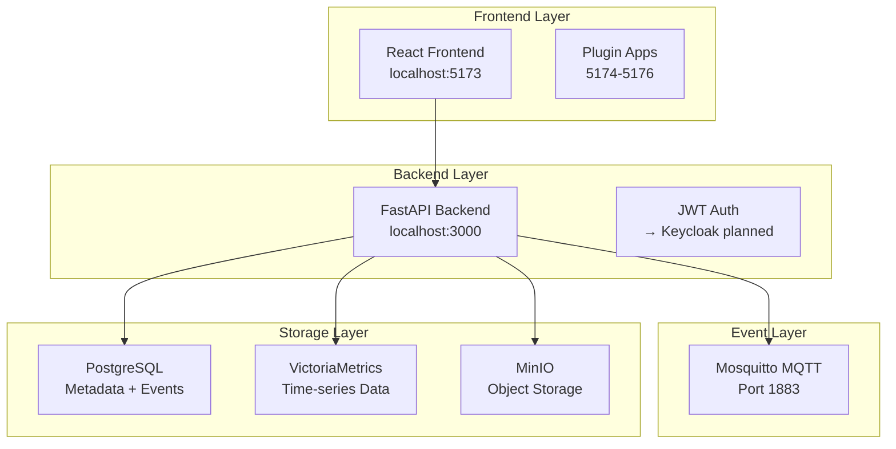

# TaylorDash Master AI Context
*Master context document for AI assistants working on the TaylorDash project*

## Project Identity & Vision

### Core Mission
TaylorDash is a **visual, add-only mission control** for home labs - a "second brain" that helps users build and finish projects with AI assistants through an event-driven, extensible architecture.

### Key Principles
- **Add-Only Philosophy**: Extend through adapters, plugins, events - never modify core
- **Visual-First**: React Flow canvas, draggable widgets, multiple perspectives
- **Local-Only**: Complete functionality without external dependencies post-setup
- **Event-Driven**: MQTT message bus for loose coupling and offline resilience
- **Security by Design**: OIDC authentication, RBAC authorization, plugin sandboxing

## Current System Reality (Sep 2025)

### What Actually Works ✅
- **Core Infrastructure**: All 8 Docker services healthy (17+ hour uptimes)
- **Backend API**: FastAPI running on localhost:3000 with OpenTelemetry
- **Frontend**: React/Vite dev server on localhost:5173
- **Database**: PostgreSQL with 21 projects stored
- **Message Bus**: Mosquitto MQTT operational
- **Observability**: Prometheus + Grafana + VictoriaMetrics stack

### Critical Gaps ❌
- **Authentication**: Basic JWT instead of advertised Keycloak OIDC
- **React Flow Canvas**: Placeholder text instead of visual project canvas
- **Plugin System**: Three standalone React apps instead of integrated system
- **Production Setup**: Development ports instead of HTTPS/Traefik routing
- **Code Quality**: 1000+ line App.tsx monolith needs refactoring

### Technology Stack
```
Frontend: React 18.2 + TypeScript + Vite + Tailwind + React Router
Backend:  FastAPI (Python) + AsyncPG + OpenTelemetry + Pydantic
Storage:  PostgreSQL + VictoriaMetrics (TSDB) + MinIO (objects)
Events:   Mosquitto MQTT v5 with JSON contracts
Auth:     JWT (currently) → Keycloak OIDC (planned)
Edge:     Traefik (configured) → Development servers (current)
Observ:   OpenTelemetry + Prometheus + Grafana
Deploy:   Docker Compose (single-node)
```

## Architecture Overview

### System Components


### Key File Locations
```
/TaylorProjects/TaylorDashv1/
├── frontend/
│   ├── src/App.tsx              # 1000+ line monolith (NEEDS REFACTOR)
│   ├── src/components/          # React components
│   ├── src/services/api.ts      # API client
│   └── package.json             # React deps
├── backend/
│   ├── app/main.py              # FastAPI application
│   ├── app/routers/             # API routes
│   ├── app/database/            # Database models
│   └── requirements.txt         # Python deps
├── examples/
│   ├── mcp-manager/             # Standalone plugin
│   ├── midnight-hud/            # Standalone plugin
│   └── projects-manager/        # Standalone plugin
├── docker-compose.yml           # Full stack orchestration
└── docs/                        # Diátaxis documentation
```

## Development Standards

### Code Quality Requirements
- **No 1000+ line files**: Break down App.tsx into proper components
- **DRY Principle**: Eliminate repeated auth header patterns (8+ instances)
- **Error Boundaries**: Proper error handling, not double boundaries
- **TypeScript**: Full type safety, no `any` types
- **Testing**: Jest/Playwright for frontend, pytest for backend

### Commit Standards
- **Conventional Commits**: `feat:`, `fix:`, `docs:`, `refactor:`, `perf:`, `test:`, `chore:`
- **Breaking Changes**: Use `!` suffix (e.g., `feat!: new auth system`)
- **SemVer Releases**: MAJOR.MINOR.PATCH versioning
- **Signed Tags**: Annotated tags for releases

### API Standards
- **OpenAPI**: Automatic documentation at `/docs`
- **Pydantic**: Request/response models with validation
- **Async/Await**: Full async patterns throughout
- **Error Handling**: Consistent HTTP status codes and error schemas
- **Authentication**: Bearer tokens with proper RBAC

## Event Architecture

### MQTT Topic Schema
```
taylor/
├── projects/
│   ├── created              # New project events
│   ├── updated              # Project state changes
│   └── completed            # Project completion
├── plugins/
│   ├── installed            # Plugin registration
│   ├── activated            # Plugin lifecycle
│   └── error                # Plugin failures
└── system/
    ├── health               # Service health events
    ├── metrics              # Performance data
    └── alerts               # System notifications
```

### Event Contract Example
```json
{
  "trace_id": "550e8400-e29b-41d4-a716-446655440000",
  "event_type": "project.created",
  "timestamp": "2025-09-14T12:00:00Z",
  "source": "frontend",
  "data": {
    "project_id": "proj-123",
    "name": "New Project",
    "created_by": "user@example.com"
  },
  "version": "1.0"
}
```

## Security Model

### Current Implementation
- **Authentication**: Basic JWT with username/password
- **Authorization**: Role-based (admin/maintainer/viewer)
- **Session Management**: Short-lived tokens with refresh
- **API Security**: Bearer tokens in Authorization header

### Target Implementation
- **OIDC Provider**: Keycloak for enterprise SSO
- **Plugin Sandbox**: Iframe isolation with controlled communication
- **TLS Termination**: Traefik with HSTS and security headers
- **Secrets Management**: Environment variables + Docker secrets

## Performance Characteristics

### Current Metrics
- **Frontend Build**: ~30s TypeScript compilation
- **Backend Startup**: <5s with all dependencies
- **Database**: PostgreSQL with connection pooling
- **Memory Usage**: ~2GB total for full stack
- **Response Times**: <100ms for API endpoints

### Optimization Targets
- **Bundle Size**: <500KB gzipped frontend
- **First Paint**: <2s on localhost
- **API Latency**: <50ms p95 response time
- **Memory**: <1.5GB total stack footprint

## Plugin Architecture (Current vs Target)

### Current Reality
```
examples/mcp-manager/     → localhost:5174 (standalone)
examples/midnight-hud/    → localhost:5175 (standalone)
examples/projects-manager/→ localhost:5176 (standalone)
```

### Target Architecture
```
plugins/
├── manifest.json         # Plugin metadata + permissions
├── src/                  # Sandboxed React component
├── api/                  # Backend integration points
└── tests/                # Plugin test suite
```

## Observability & Monitoring

### OpenTelemetry Integration
- **Traces**: End-to-end request tracing with correlation IDs
- **Metrics**: Custom business metrics + system metrics
- **Logging**: Structured JSON logs with trace correlation
- **Dashboards**: Grafana for operations visibility

### Key Metrics to Track
```
# Business Metrics
taylor_projects_total{status="active|completed|archived"}
taylor_plugin_executions_total{plugin="name",status="success|error"}
taylor_user_sessions_active

# System Metrics
taylor_api_request_duration_seconds{method,endpoint}
taylor_mqtt_messages_total{topic,status}
taylor_database_connections_active
```

## Component Status Matrix

### Infrastructure (Phase 1)
- ✅ Docker Compose orchestration
- ✅ PostgreSQL database
- ✅ MQTT message bus
- ✅ Monitoring stack (Prometheus/Grafana)
- ❌ Traefik TLS termination (configured, not active)
- ❌ Production environment setup

### Backend Services (Phase 1)
- ✅ FastAPI application framework
- ✅ OpenTelemetry instrumentation
- ✅ Database connection pooling
- ✅ MQTT client integration
- ❌ Keycloak OIDC integration
- ❌ Plugin API framework

### Frontend Application (Phase 1)
- ✅ React application structure
- ✅ TypeScript configuration
- ✅ Tailwind CSS styling
- ✅ Router navigation
- ❌ React Flow canvas implementation
- ❌ Plugin integration system
- ❌ Component architecture (needs refactor)

### Security & Authentication
- ⚠️ Basic JWT authentication (works, not target)
- ❌ Keycloak OIDC provider
- ❌ Role-based access control
- ❌ Plugin sandboxing
- ❌ TLS/HTTPS in production

## Phase Progression Strategy

### Phase 1: Foundation (Current - 90% Complete)
**Goal**: Core infrastructure and basic functionality
**Status**: Infrastructure healthy, major features missing
**Next Steps**: Fix authentication, implement canvas, refactor frontend

### Phase 2: Visual Canvas (Next Priority)
**Goal**: React Flow implementation with project visualization
**Requirements**:
- Drag-and-drop project nodes
- Dependency visualization
- Progress tracking badges
- State persistence

### Phase 3: Plugin System (Following)
**Goal**: True plugin architecture with sandboxing
**Requirements**:
- Plugin manifest system
- Iframe sandboxing
- Permission model
- API proxy layer

### Phase 4: Production Ready
**Goal**: HTTPS, authentication, monitoring
**Requirements**:
- Keycloak OIDC integration
- Traefik TLS termination
- Production docker-compose
- Security hardening

## Success Criteria

### Technical Excellence
- [ ] No files >500 lines (currently App.tsx is 1000+)
- [ ] 90%+ TypeScript coverage
- [ ] <100ms API response times
- [ ] Zero security vulnerabilities
- [ ] Comprehensive test coverage

### Feature Completeness
- [ ] Visual React Flow canvas operational
- [ ] Plugin system with sandboxing
- [ ] OIDC authentication integrated
- [ ] Production HTTPS deployment
- [ ] Real-time event streaming

### User Experience
- [ ] <2s initial page load
- [ ] Responsive design all devices
- [ ] Accessible (WCAG 2.1 AA)
- [ ] Intuitive navigation
- [ ] Error handling with recovery

## AI Assistant Guidelines

### When Working on TaylorDash
1. **Read System Reality First**: Always check current status vs documentation claims
2. **Prefer Existing Files**: Edit existing code rather than create new files
3. **Follow Add-Only**: Extend through adapters/events, don't modify core
4. **Check Dependencies**: Understand the full stack before making changes
5. **Test Integration**: Changes must work with MQTT/auth/observability

### Common Pitfalls to Avoid
- Don't trust documentation claims - verify current implementation
- Don't create new files when editing existing ones works
- Don't break the add-only architecture principle
- Don't assume Keycloak is working (it's not integrated yet)
- Don't ignore the 1000+ line App.tsx that needs refactoring

### Key Commands for Development
```bash
# Start full stack
docker compose up -d

# Frontend development
cd frontend && npm run dev

# Backend development
cd backend && python -m uvicorn app.main:app --reload

# Health check
bash ops/validate_p1.sh

# View logs
docker compose logs -f [service]
```

This context provides the complete picture for any AI assistant to understand TaylorDash's current state, architecture, and development needs without additional research.