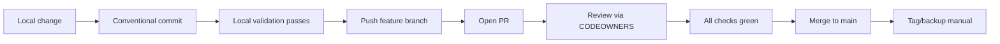

# Using Git in TaylorDash (Auth already configured)

TaylorDash follows strict Git hygiene with [Conventional Commits](https://www.conventionalcommits.org/) and [Semantic Versioning](https://semver.org/). This guide assumes authentication is already set up.

## Commit Style

Use [Conventional Commits](https://www.conventionalcommits.org/) format:

```
<type>(<scope>): <description>

[optional body]

[optional footer(s)]
```

**Types:**
- `feat`: New feature
- `fix`: Bug fix
- `docs`: Documentation changes
- `chore`: Maintenance tasks
- `refactor`: Code refactoring
- `perf`: Performance improvements
- `test`: Adding/updating tests
- `build`: Build system changes
- `ci`: CI configuration changes

**Examples:**
```bash
git commit -m "feat(ui): add multi-view tabs"
git commit -m "fix(api): resolve authentication timeout"
git commit -m "docs(readme): update installation steps"
```

**Breaking Changes:**
```bash
# Use ! after type/scope
git commit -m "feat(api)!: change event schema format"

# Or in footer
git commit -m "feat(api): change event schema

BREAKING CHANGE: Event payload now requires 'version' field"
```

This dovetails with [Semantic Versioning 2.0.0](https://semver.org/) and marks breaking changes for automated version bumping.

## Versioning

We follow [Semantic Versioning 2.0.0](https://semver.org/): **MAJOR.MINOR.PATCH**

**Quick rules for bumping:**
- **MAJOR**: Breaking changes (API incompatible)
- **MINOR**: New features (backwards compatible)
- **PATCH**: Bug fixes (backwards compatible)

## Branch Model

- **`main`** is protected; no direct pushes allowed
- Feature work happens on short-lived branches:
  - `feat/<area>-<slug>` (e.g., `feat/core-reactflow`)
  - `fix/<area>-<slug>` (e.g., `fix/api-timeout`)

Open a PR to merge; [branch protection](https://docs.github.com/en/repositories/configuring-branches-and-merges-in-your-repository/managing-protected-branches) enforces reviews and may require [signed commits](https://docs.github.com/en/authentication/managing-commit-signature-verification/signing-commits).

## PR Expectations

Each pull request should:
- **Link issue** in description
- **Summarize change** (what & why)
- **List tests run** locally
- **Confirm docs/ADRs updated** if interfaces changed
- **Pass local validation** (`ops/validate_p1.sh`) before pushing
- **Include schema diff** and ADR number if API/event contracts changed

## Code Ownership

[CODEOWNERS](https://docs.github.com/en/repositories/managing-your-repositorys-settings-and-features/customizing-your-repository/about-code-owners) auto-requests reviews from `@11bztaylor` (and any future owners). This ensures all changes are reviewed before merging.

## Cheat Sheet (Auth Already Done)

```bash
# Create feature branch
git switch -c feat/core-reactflow

# Make changes and commit
git add -A && git commit -m "feat(core): react flow canvas nodes"

# Push feature branch
git push -u origin feat/core-reactflow

# Open PR; ensure checks green; merge via squash or rebase per CONTRIBUTING
```

## Workflow



## FAQ

**Q: Already logged in—why did Git prompt me?**
A: Stale credential cache. Check your OS credential store (Windows Credential Manager, macOS Keychain, or Linux keyring) and refresh the stored credentials.

## References

- [Conventional Commits](https://www.conventionalcommits.org/) - Commit message format
- [Semantic Versioning 2.0.0](https://semver.org/) - Versioning rules
- [GitHub PR Templates](https://docs.github.com/en/communities/using-templates-to-encourage-useful-issues-and-pull-requests/creating-a-pull-request-template-for-your-repository) - PR template setup
- [GitHub Protected Branches](https://docs.github.com/en/repositories/configuring-branches-and-merges-in-your-repository/managing-protected-branches) - Branch protection rules

## Secret Prevention

### Rules

1. **Never commit secrets** - use `.env.example` pattern
2. **gitleaks blocks secrets automatically** 
3. **All environment variables go in `.env` (gitignored)**
4. **Configuration templates go in `.env.example` (versioned)**

### .env Pattern

```bash
# .env (gitignored - contains real secrets)
POSTGRES_PASSWORD=real_secure_password_123
MINIO_ROOT_PASSWORD=real_minio_password_456

# .env.example (versioned - contains templates)  
POSTGRES_PASSWORD=your_postgres_password_here
MINIO_ROOT_PASSWORD=your_minio_password_here
```

### False Positive Handling

If gitleaks incorrectly flags something:

1. **Verify it's actually safe** (not a real secret)
2. **Add to `.gitleaksignore`** (create if needed):
```
# False positive - example in documentation
docs/security.md:JWT_SECRET=example_only_not_real
```

## Git LFS (Future)

If we need to version large binaries (dashboard exports, recordings):

```bash
# Install Git LFS
git lfs install

# Track file types
git lfs track "*.mp4"
git lfs track "*.png"

# Commit .gitattributes
git add .gitattributes
git commit -m "chore: configure Git LFS for media files"
```

## Troubleshooting

### Pre-commit Not Running

```bash
# Reinstall hooks
pre-commit clean
pre-commit install --install-hooks

# Test manually
pre-commit run --all-files
```

### SSH Key Issues

```bash
# Test SSH connection
ssh -T git@github.com

# Debug SSH issues
ssh -vT git@github.com
```

### Line Ending Issues

```bash
# Fix line endings (after .gitattributes change)
git add --renormalize .
git commit -m "chore: normalize line endings"
```

## Further Reading

- [Conventional Commits](https://www.conventionalcommits.org/)
- [GitHub SSH Documentation](https://docs.github.com/en/authentication/connecting-to-github-with-ssh)
- [Pre-commit Framework](https://pre-commit.com/)
- [Git LFS Documentation](https://git-lfs.github.io/)