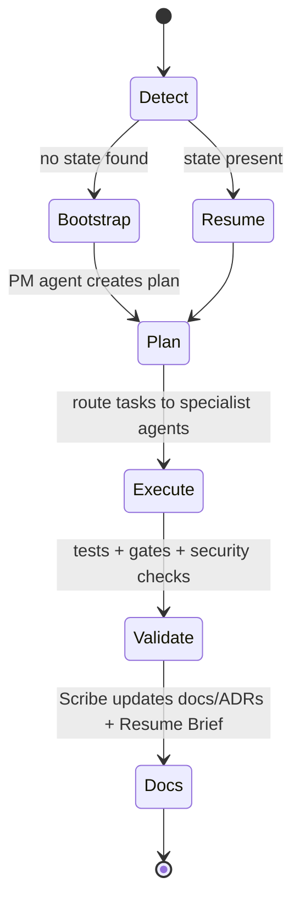
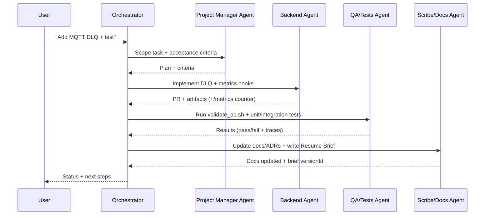

# Primary Orchestrator (AI) — Role, Contracts, and Flow

The **Primary Orchestrator AI** is a **builder-of-builders**. It **does not "do" the work** that belongs to a specialist agent. It **routes**, **guards**, and **audits** the work:
- Chooses the right **specialist agent** for each task and provides context.
- Verifies outputs against **contracts** (APIs, event schemas, security, tests).
- Ensures **docs and ADRs** get updated by the Scribe/Docs agent.
- Emits **traces/metrics/logs** for every orchestration step (OpenTelemetry + /metrics).

This aligns with modern **multi-agent orchestration** patterns (e.g., LangGraph/AutoGen) where a controller manages state, routes sub-tasks, and enforces tool/role boundaries.

---

## SMART MODE (Idempotent Entry)

On every start:

**Detect state**
- If `taylordash/state/agents.json` and `docker-compose.yml` exist → **Resume Mode**
- Otherwise → **Bootstrap Mode**

**Bootstrap Mode**
1) Create repo skeleton & infra (Compose, health checks, restart policies).  
2) Instantiate **agent roster** and persist to `state/agents.json`.  
3) Generate docs (Diátaxis), ADRs, and initial **Resume Brief**.

**Resume Mode**
1) Load **latest Resume Brief** (MinIO) + last 50 **Run Journal** entries.  
2) Propose a 3–7 item **Session Plan** (start with fixing doc/test drift).  
3) Execute via agents; update Run Journal, docs, and new Resume Brief.

---

## Orchestration State Machine

## Sequence (One Task)

## Guardrails (Non-Negotiable)

**Role separation**: Orchestrator routes; specialist agents implement; Scribe updates docs.

**Observability**: Every step emits OTel spans; backend exposes Prometheus metrics at /metrics.

**Security**: All non-health/metrics calls use OIDC/JWT (Keycloak) and RBAC (admin/maintainer/viewer).

**Event-driven**: Changes are published on MQTT topics with trace_id, idempotency keys, and DLQ handling.

**Docs-as-code** via Diátaxis + ADRs (MADR-style).

## Contracts to Check on Every Task

**API/Schema**: OpenAPI + event JSON schemas still valid.

**Security**: JWT required, roles enforced, secrets safe. (Keycloak RBAC; Mosquitto auth/TLS)

**Observability**: New counters/gauges/histograms named correctly; spans/log correlation works.

**Validation Gates**: Health, events mirror, TSDB round-trip, RBAC, observability, security, no egress (see docs/validation-gates.md).

## What "Done" Means (per task)

**PR passes** tests/gates and adds/updates metrics where relevant.

**Run Journal** got an entry (schema in docs/specs/run-journal.md).

**Scribe updated** docs/ADRs; Resume Brief saved to MinIO (schema in docs/specs/resume-brief.md).

**Orchestrator posted** a summary with trace_id links.