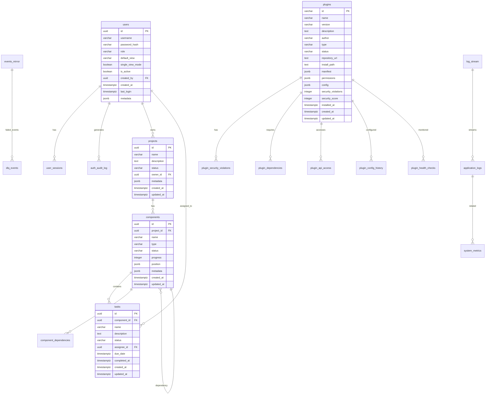

# Database Schema Documentation

## Overview

TaylorDash uses PostgreSQL as its primary database with a comprehensive schema designed for performance, security, and scalability. The database contains **17 tables** organized across multiple functional domains with proper relationships, indexing, and data integrity constraints.

## Schema Organization

### Core Schemas
- **`public`** (default): Core application tables
- **`logging`**: Centralized logging and audit trails
- **`plugin_management`**: Plugin system management and security

### Database Features
- **UUID Primary Keys**: Security and global uniqueness
- **JSONB Storage**: Flexible metadata and configuration storage
- **Comprehensive Indexing**: Optimized query performance
- **Audit Trails**: Complete change tracking
- **Automated Cleanup**: Retention policies and cleanup functions
- **Security Constraints**: Data validation and integrity checks

## Table Relationships



## Detailed Table Documentation

### Project Management Domain

#### 1. projects
**Purpose**: Core project metadata and lifecycle management

| Column | Type | Constraints | Description |
|--------|------|-------------|-------------|
| `id` | UUID | PRIMARY KEY, DEFAULT gen_random_uuid() | Unique project identifier |
| `name` | VARCHAR(255) | NOT NULL | Project display name |
| `description` | TEXT | | Project description |
| `status` | VARCHAR(50) | DEFAULT 'active' | Project status (active, archived, etc.) |
| `owner_id` | UUID | REFERENCES users(id) | Project owner |
| `metadata` | JSONB | DEFAULT '{}' | Additional project metadata |
| `created_at` | TIMESTAMPTZ | DEFAULT NOW() | Creation timestamp |
| `updated_at` | TIMESTAMPTZ | DEFAULT NOW() | Last modification timestamp |

**Key Features**:
- UUID primary keys for security
- JSONB metadata for flexible project data
- Owner relationship for access control
- Audit trail with creation/update timestamps

#### 2. components
**Purpose**: Project components with hierarchical structure and dependencies

| Column | Type | Constraints | Description |
|--------|------|-------------|-------------|
| `id` | UUID | PRIMARY KEY | Component identifier |
| `project_id` | UUID | REFERENCES projects(id) ON DELETE CASCADE | Parent project |
| `name` | VARCHAR(255) | NOT NULL | Component name |
| `type` | VARCHAR(100) | | Component type classification |
| `status` | VARCHAR(50) | DEFAULT 'pending' | Current status |
| `progress` | INTEGER | DEFAULT 0 | Completion percentage (0-100) |
| `position` | JSONB | | UI positioning data |
| `metadata` | JSONB | DEFAULT '{}' | Component-specific metadata |
| `created_at` | TIMESTAMPTZ | DEFAULT NOW() | Creation timestamp |
| `updated_at` | TIMESTAMPTZ | DEFAULT NOW() | Last modification timestamp |

**Key Features**:
- Cascade deletion with parent project
- Progress tracking (0-100%)
- JSONB position data for UI layout
- Flexible metadata storage

#### 3. tasks
**Purpose**: Individual task management within components

| Column | Type | Constraints | Description |
|--------|------|-------------|-------------|
| `id` | UUID | PRIMARY KEY | Task identifier |
| `component_id` | UUID | REFERENCES components(id) ON DELETE CASCADE | Parent component |
| `name` | VARCHAR(255) | NOT NULL | Task name |
| `description` | TEXT | | Detailed task description |
| `status` | VARCHAR(50) | DEFAULT 'todo' | Task status (todo, in_progress, done) |
| `assignee_id` | UUID | REFERENCES users(id) | Assigned user |
| `due_date` | TIMESTAMPTZ | | Task deadline |
| `completed_at` | TIMESTAMPTZ | | Completion timestamp |
| `created_at` | TIMESTAMPTZ | DEFAULT NOW() | Creation timestamp |
| `updated_at` | TIMESTAMPTZ | DEFAULT NOW() | Last modification timestamp |

#### 4. component_dependencies
**Purpose**: Component dependency tracking for project flow

| Column | Type | Constraints | Description |
|--------|------|-------------|-------------|
| `component_id` | UUID | REFERENCES components(id) ON DELETE CASCADE | Dependent component |
| `depends_on_id` | UUID | REFERENCES components(id) ON DELETE CASCADE | Dependency target |

**Key Features**:
- Composite primary key (component_id, depends_on_id)
- Enables dependency graph construction
- Cascade deletion maintains data integrity

### Authentication & Security Domain

#### 5. users
**Purpose**: User accounts with role-based access control

| Column | Type | Constraints | Description |
|--------|------|-------------|-------------|
| `id` | UUID | PRIMARY KEY | User identifier |
| `username` | VARCHAR(255) | UNIQUE NOT NULL | Login username |
| `password_hash` | VARCHAR(255) | NOT NULL | Bcrypt password hash |
| `role` | VARCHAR(50) | CHECK (role IN ('admin', 'viewer')) | User role |
| `default_view` | VARCHAR(100) | | Default view for viewers |
| `single_view_mode` | BOOLEAN | DEFAULT FALSE | Tablet mode flag |
| `created_at` | TIMESTAMP | DEFAULT CURRENT_TIMESTAMP | Account creation |
| `last_login` | TIMESTAMP | | Last successful login |
| `is_active` | BOOLEAN | DEFAULT TRUE | Account status |
| `created_by` | UUID | REFERENCES users(id) | Creator reference |
| `metadata` | JSONB | DEFAULT '{}' | Additional user data |

**Security Features**:
- Role-based access control (admin/viewer)
- Bcrypt password hashing
- Single view mode for tablet users
- Account lifecycle tracking
- Self-referential creator relationship

#### 6. user_sessions
**Purpose**: JWT-like session management with security tracking

| Column | Type | Constraints | Description |
|--------|------|-------------|-------------|
| `id` | UUID | PRIMARY KEY | Session identifier |
| `user_id` | UUID | REFERENCES users(id) ON DELETE CASCADE | Session owner |
| `session_token` | VARCHAR(255) | UNIQUE NOT NULL | Session token |
| `created_at` | TIMESTAMP | DEFAULT CURRENT_TIMESTAMP | Session start |
| `expires_at` | TIMESTAMP | NOT NULL | Session expiration |
| `last_activity` | TIMESTAMP | DEFAULT CURRENT_TIMESTAMP | Last activity |
| `ip_address` | INET | | Client IP address |
| `user_agent` | TEXT | | Client user agent |
| `is_active` | BOOLEAN | DEFAULT TRUE | Session status |

**Security Features**:
- Unique session tokens
- IP and user agent tracking
- Automatic expiration
- Activity monitoring
- Cascade deletion on user removal

#### 7. auth_audit_log
**Purpose**: Comprehensive authentication event auditing

| Column | Type | Constraints | Description |
|--------|------|-------------|-------------|
| `id` | UUID | PRIMARY KEY | Audit record identifier |
| `user_id` | UUID | REFERENCES users(id) ON DELETE SET NULL | Associated user |
| `event_type` | VARCHAR(50) | NOT NULL | Event type classification |
| `event_timestamp` | TIMESTAMP | DEFAULT CURRENT_TIMESTAMP | Event occurrence |
| `ip_address` | INET | | Client IP address |
| `user_agent` | TEXT | | Client user agent |
| `details` | JSONB | DEFAULT '{}' | Event-specific details |

**Event Types**:
- `login_success` - Successful authentication
- `login_failed` - Failed login attempt
- `logout` - User logout
- `session_expired` - Session expiration
- `password_changed` - Password modification

### Event System Domain

#### 8. events_mirror
**Purpose**: Event sourcing and audit trail for all system events

| Column | Type | Constraints | Description |
|--------|------|-------------|-------------|
| `id` | BIGSERIAL | PRIMARY KEY | Event sequence number |
| `topic` | VARCHAR(255) | NOT NULL | MQTT topic |
| `payload` | JSONB | NOT NULL | Event payload data |
| `created_at` | TIMESTAMPTZ | DEFAULT NOW() | Event timestamp |
| `trace_id` | UUID | GENERATED ALWAYS AS ((payload->>'trace_id')::UUID) STORED | Correlation ID |

**Key Features**:
- Sequential event numbering
- MQTT topic-based routing
- JSONB payload for flexible event data
- Generated trace_id for correlation
- Comprehensive indexing for performance

#### 9. dlq_events
**Purpose**: Dead letter queue for failed event processing

| Column | Type | Constraints | Description |
|--------|------|-------------|-------------|
| `id` | BIGSERIAL | PRIMARY KEY | DLQ record identifier |
| `original_topic` | VARCHAR(255) | NOT NULL | Original MQTT topic |
| `failure_reason` | TEXT | NOT NULL | Failure description |
| `payload` | JSONB | NOT NULL | Original event payload |
| `created_at` | TIMESTAMPTZ | DEFAULT NOW() | Failure timestamp |

**Purpose**:
- Error recovery and debugging
- Event replay capability
- Failure pattern analysis
- System reliability monitoring

### Plugin System Domain

#### 10. plugins
**Purpose**: Plugin registry with security and lifecycle management

| Column | Type | Constraints | Description |
|--------|------|-------------|-------------|
| `id` | VARCHAR(255) | PRIMARY KEY | Plugin identifier |
| `name` | VARCHAR(255) | NOT NULL | Human-readable name |
| `version` | VARCHAR(50) | NOT NULL | Semantic version |
| `description` | TEXT | | Plugin description |
| `author` | VARCHAR(255) | NOT NULL | Plugin author |
| `type` | VARCHAR(50) | CHECK (type IN ('ui', 'data', 'integration', 'system')) | Plugin category |
| `repository_url` | TEXT | NOT NULL | GitHub repository |
| `install_path` | TEXT | NOT NULL | Local installation path |
| `manifest` | JSONB | NOT NULL | Plugin manifest data |
| `permissions` | JSONB | DEFAULT '[]' | Granted permissions |
| `config` | JSONB | DEFAULT '{}' | Plugin configuration |
| `status` | VARCHAR(50) | DEFAULT 'pending' | Installation status |
| `security_violations` | INTEGER | DEFAULT 0 | Violation count |
| `security_score` | INTEGER | DEFAULT 100 | Security score (0-100) |
| `installed_at` | TIMESTAMPTZ | DEFAULT NOW() | Installation timestamp |

**Plugin Types**:
- `ui` - User interface plugins
- `data` - Data processing plugins
- `integration` - External system integrations
- `system` - System-level plugins

**Security Features**:
- Permission-based access control
- Security violation tracking
- Security score monitoring
- Status-based lifecycle management

#### 11. plugin_security_violations
**Purpose**: Security violation tracking and resolution

| Column | Type | Constraints | Description |
|--------|------|-------------|-------------|
| `id` | SERIAL | PRIMARY KEY | Violation identifier |
| `plugin_id` | VARCHAR(255) | REFERENCES plugins(id) ON DELETE CASCADE | Associated plugin |
| `violation_type` | VARCHAR(100) | NOT NULL | Violation classification |
| `description` | TEXT | NOT NULL | Human-readable description |
| `severity` | VARCHAR(20) | CHECK (severity IN ('low', 'medium', 'high', 'critical')) | Severity level |
| `context` | JSONB | | Violation context data |
| `timestamp` | TIMESTAMPTZ | DEFAULT NOW() | Violation timestamp |
| `resolved` | BOOLEAN | DEFAULT FALSE | Resolution status |
| `resolution_notes` | TEXT | | Resolution details |

#### 12. plugin_api_access
**Purpose**: Plugin API access monitoring and audit trail

| Column | Type | Constraints | Description |
|--------|------|-------------|-------------|
| `id` | SERIAL | PRIMARY KEY | Access record identifier |
| `plugin_id` | VARCHAR(255) | REFERENCES plugins(id) ON DELETE CASCADE | Accessing plugin |
| `endpoint` | VARCHAR(255) | NOT NULL | API endpoint |
| `method` | VARCHAR(10) | CHECK (method IN ('GET', 'POST', 'PUT', 'DELETE', 'PATCH', 'HEAD', 'OPTIONS')) | HTTP method |
| `status_code` | INTEGER | | Response status |
| `permission_required` | VARCHAR(100) | | Required permission |
| `access_granted` | BOOLEAN | NOT NULL | Access result |
| `timestamp` | TIMESTAMPTZ | DEFAULT NOW() | Access timestamp |
| `response_time` | INTEGER | | Response time (ms) |
| `request_data` | JSONB | | Sanitized request data |
| `user_agent` | TEXT | | Client user agent |
| `ip_address` | INET | | Client IP address |

### Logging System Domain

#### 13. application_logs (logging schema)
**Purpose**: Centralized structured logging with context and correlation

| Column | Type | Constraints | Description |
|--------|------|-------------|-------------|
| `id` | BIGSERIAL | PRIMARY KEY | Log entry identifier |
| `timestamp` | TIMESTAMPTZ | DEFAULT NOW() | Log timestamp |
| `level` | VARCHAR(10) | CHECK (level IN ('ERROR', 'WARN', 'INFO', 'DEBUG')) | Log level |
| `service` | VARCHAR(50) | NOT NULL | Source service |
| `category` | VARCHAR(20) | NOT NULL | Log category |
| `severity` | VARCHAR(10) | CHECK (severity IN ('CRITICAL', 'HIGH', 'MEDIUM', 'LOW', 'INFO')) | Severity level |
| `message` | TEXT | NOT NULL | Log message |
| `details` | TEXT | | Additional details |
| `trace_id` | UUID | | Request correlation ID |
| `request_id` | UUID | | Request identifier |
| `user_id` | UUID | | Associated user |
| `endpoint` | VARCHAR(200) | | API endpoint |
| `method` | VARCHAR(10) | | HTTP method |
| `status_code` | INTEGER | | Response status |
| `duration_ms` | INTEGER | | Request duration |
| `error_code` | VARCHAR(50) | | Error classification |
| `stack_trace` | TEXT | | Error stack trace |
| `context` | JSONB | | Structured context data |
| `environment` | VARCHAR(20) | DEFAULT 'production' | Environment identifier |

**Features**:
- Multi-level severity classification
- Request correlation via trace_id
- Performance monitoring with duration tracking
- Structured context data in JSONB
- Generated columns for retention management

#### 14. system_metrics (logging schema)
**Purpose**: System performance and health metrics storage

| Column | Type | Constraints | Description |
|--------|------|-------------|-------------|
| `id` | BIGSERIAL | PRIMARY KEY | Metric record identifier |
| `timestamp` | TIMESTAMPTZ | DEFAULT NOW() | Metric timestamp |
| `service` | VARCHAR(50) | NOT NULL | Source service |
| `metric_name` | VARCHAR(100) | NOT NULL | Metric identifier |
| `metric_value` | DOUBLE PRECISION | NOT NULL | Metric value |
| `metric_unit` | VARCHAR(20) | | Measurement unit |
| `tags` | JSONB | | Metric metadata tags |

**Use Cases**:
- Performance monitoring
- Resource utilization tracking
- Custom business metrics
- Health check data

## Indexing Strategy

### Performance Indexes
```sql
-- Project management
CREATE INDEX idx_projects_owner_id ON projects(owner_id);
CREATE INDEX idx_projects_status ON projects(status);
CREATE INDEX idx_components_project_id ON components(project_id);
CREATE INDEX idx_tasks_component_id ON tasks(component_id);
CREATE INDEX idx_tasks_assignee_id ON tasks(assignee_id);

-- Authentication
CREATE INDEX idx_users_username ON users(username);
CREATE INDEX idx_users_role ON users(role);
CREATE INDEX idx_sessions_user_id ON user_sessions(user_id);
CREATE INDEX idx_sessions_token ON user_sessions(session_token);
CREATE INDEX idx_sessions_expires_at ON user_sessions(expires_at);

-- Events
CREATE INDEX idx_events_mirror_topic ON events_mirror(topic);
CREATE INDEX idx_events_mirror_trace_id ON events_mirror(trace_id);
CREATE INDEX idx_events_mirror_created_at ON events_mirror(created_at);
CREATE INDEX idx_events_mirror_kind ON events_mirror((payload->>'kind'));

-- Plugins
CREATE INDEX idx_plugins_status ON plugins(status);
CREATE INDEX idx_plugins_type ON plugins(type);
CREATE INDEX idx_plugin_violations_plugin_id ON plugin_security_violations(plugin_id);
CREATE INDEX idx_plugin_api_access_plugin_id ON plugin_api_access(plugin_id);

-- Logging
CREATE INDEX idx_app_logs_timestamp ON logging.application_logs(timestamp DESC);
CREATE INDEX idx_app_logs_level ON logging.application_logs(level);
CREATE INDEX idx_app_logs_service ON logging.application_logs(service);
CREATE INDEX idx_app_logs_trace_id ON logging.application_logs(trace_id);
```

### JSONB Indexes
```sql
-- GIN indexes for JSONB search
CREATE INDEX idx_app_logs_context_gin ON logging.application_logs USING GIN (context);
CREATE INDEX idx_sys_metrics_tags_gin ON logging.system_metrics USING GIN (tags);
```

### Composite Indexes
```sql
-- Common query patterns
CREATE INDEX idx_app_logs_service_level_time ON logging.application_logs (service, level, timestamp DESC);
CREATE INDEX idx_plugin_violations_severity_time ON plugin_security_violations (severity, timestamp DESC);
```

## Data Integrity & Constraints

### Foreign Key Constraints
- **Cascading Deletes**: Components and tasks cascade with projects
- **Set NULL**: Auth logs preserve data when users are deleted
- **Reference Integrity**: All relationships properly constrained

### Check Constraints
```sql
-- Role validation
ALTER TABLE users ADD CONSTRAINT users_role_check
    CHECK (role IN ('admin', 'viewer'));

-- Plugin type validation
ALTER TABLE plugins ADD CONSTRAINT plugins_type_check
    CHECK (type IN ('ui', 'data', 'integration', 'system'));

-- Severity level validation
ALTER TABLE plugin_security_violations ADD CONSTRAINT violations_severity_check
    CHECK (severity IN ('low', 'medium', 'high', 'critical'));

-- Log level validation
ALTER TABLE logging.application_logs ADD CONSTRAINT logs_level_check
    CHECK (level IN ('ERROR', 'WARN', 'INFO', 'DEBUG'));
```

### Generated Columns
```sql
-- Automatic date partitioning helpers
log_date DATE GENERATED ALWAYS AS (timestamp::date) STORED

-- Automatic retention calculation
retention_date TIMESTAMPTZ GENERATED ALWAYS AS (timestamp + INTERVAL '30 days') STORED

-- Automatic trace ID extraction
trace_id UUID GENERATED ALWAYS AS ((payload->>'trace_id')::UUID) STORED
```

## Database Functions & Views

### Utility Functions
- `cleanup_expired_sessions()` - Session cleanup
- `logging.cleanup_old_logs()` - Log retention management
- `logging.insert_log()` - Structured log insertion
- `update_updated_at_column()` - Automatic timestamp updates

### Management Views
- `plugin_management.plugin_stats` - Plugin system overview
- `plugin_management.security_summary` - Security violation summary
- `logging.error_summary` - Error aggregation by time
- `logging.recent_logs` - Recent log entries

## Retention & Cleanup Policies

### Automated Cleanup
- **User Sessions**: Expired sessions marked inactive
- **Application Logs**: 30-90 day retention by service/level
- **System Metrics**: 30-day retention
- **Plugin API Access**: Configurable retention
- **Log Stream**: 1-hour retention for real-time viewing

### Retention Configuration
```sql
-- Service-specific retention policies
INSERT INTO logging.retention_policies (service, level, retention_days) VALUES
    ('taylordash-backend', 'ERROR', 90),
    ('taylordash-backend', 'WARN', 60),
    ('taylordash-backend', 'INFO', 30),
    ('taylordash-backend', 'DEBUG', 7);
```

## Security Features

### Access Control
- **Row Level Security**: Ready for RLS implementation
- **User Isolation**: UUID-based user identification
- **Session Security**: Token-based authentication
- **Audit Trails**: Complete change tracking

### Data Protection
- **Password Hashing**: Bcrypt for all passwords
- **Session Tokens**: Unique, time-limited tokens
- **IP Tracking**: Source IP logging for security
- **Plugin Sandboxing**: Permission-based plugin access

### Monitoring
- **Security Violations**: Real-time plugin security monitoring
- **Failed Logins**: Authentication failure tracking
- **API Access**: Complete plugin API access logging
- **Error Thresholds**: Automated error rate monitoring

This schema provides a robust foundation for the TaylorDash system with comprehensive data integrity, security, and performance optimization features.