# Monitoring & Observability Architecture

## Overview

TaylorDash implements a comprehensive monitoring and observability stack that provides deep insights into system performance, health, and behavior. The system includes structured logging, metrics collection, distributed tracing, and real-time alerting capabilities.

## Observability Stack Status

**Current Production State:**
- ✅ Structured logging with database integration operational
- ✅ Prometheus metrics collection active
- ✅ VictoriaMetrics TSDB with 30-day retention
- ✅ Grafana dashboards with real-time visualization
- ✅ Comprehensive health monitoring across all services
- ✅ Error tracking and alerting systems
- ✅ Performance monitoring with sub-second response times
- ✅ Audit trail and compliance logging

## Architecture Overview

```mermaid
graph TB
    subgraph "Application Layer"
        Backend[🚀 FastAPI Backend]
        Frontend[🎨 React Frontend]
        Plugins[🔌 Plugin System]
        MQTT[📡 MQTT Broker]
    end

    subgraph "Logging Infrastructure"
        StructLogger[📝 Structured Logger]
        LogDB[(🗄️ Logging Database)]
        LogViewer[📖 Log Viewer API]
        LogRetention[🗂️ Retention Policies]
    end

    subgraph "Metrics Collection"
        PrometheusMetrics[📊 Prometheus Metrics]
        PrometheusServer[🎯 Prometheus Server]
        VictoriaMetrics[📈 VictoriaMetrics TSDB]
        CustomMetrics[📏 Custom Metrics]
    end

    subgraph "Visualization & Dashboards"
        Grafana[📊 Grafana]
        SystemDashboard[🖥️ System Dashboard]
        SecurityDashboard[🔒 Security Dashboard]
        PerformanceDashboard[⚡ Performance Dashboard]
        AlertManager[🚨 Alert Manager]
    end

    subgraph "Health Monitoring"
        HealthChecks[💓 Health Checks]
        ServiceDiscovery[🔍 Service Discovery]
        UptimeMonitoring[⏱️ Uptime Monitoring]
        DependencyHealth[🔗 Dependency Health]
    end

    subgraph "Tracing & Correlation"
        OpenTelemetry[🔍 OpenTelemetry]
        TraceCollection[📊 Trace Collection]
        RequestCorrelation[🔗 Request Correlation]
        ErrorTracking[🐛 Error Tracking]
    end

    Backend --> StructLogger
    Frontend --> StructLogger
    Plugins --> StructLogger
    MQTT --> StructLogger

    StructLogger --> LogDB
    LogDB --> LogViewer
    LogDB --> LogRetention

    Backend --> PrometheusMetrics
    PrometheusMetrics --> PrometheusServer
    PrometheusServer --> VictoriaMetrics
    CustomMetrics --> VictoriaMetrics

    VictoriaMetrics --> Grafana
    PrometheusServer --> Grafana
    Grafana --> SystemDashboard
    Grafana --> SecurityDashboard
    Grafana --> PerformanceDashboard
    Grafana --> AlertManager

    Backend --> HealthChecks
    HealthChecks --> ServiceDiscovery
    ServiceDiscovery --> UptimeMonitoring
    UptimeMonitoring --> DependencyHealth

    Backend --> OpenTelemetry
    OpenTelemetry --> TraceCollection
    TraceCollection --> RequestCorrelation
    RequestCorrelation --> ErrorTracking

    classDef app fill:#e3f2fd
    classDef logging fill:#e8f5e8
    classDef metrics fill:#fff3e0
    classDef visual fill:#f3e5f5
    classDef health fill:#ffebee
    classDef tracing fill:#e0f2f1

    class Backend,Frontend,Plugins,MQTT app
    class StructLogger,LogDB,LogViewer,LogRetention logging
    class PrometheusMetrics,PrometheusServer,VictoriaMetrics,CustomMetrics metrics
    class Grafana,SystemDashboard,SecurityDashboard,PerformanceDashboard,AlertManager visual
    class HealthChecks,ServiceDiscovery,UptimeMonitoring,DependencyHealth health
    class OpenTelemetry,TraceCollection,RequestCorrelation,ErrorTracking tracing
```



## Structured Logging System

### Centralized Logging Architecture

TaylorDash implements a sophisticated structured logging system that captures all application events, errors, and performance metrics with full context and correlation.

#### Logging Components

```python
class StructuredLogger:
    """Enhanced logger with structured output and database integration"""

    def __init__(self, service_name: str, db_pool: Optional[asyncpg.Pool] = None):
        self.service_name = service_name
        self.db_pool = db_pool
        self.logger = logging.getLogger(service_name)

    async def log(self, level: str, category: str, severity: str, message: str,
                  details: str = None, trace_id: str = None, request_id: str = None,
                  user_id: str = None, endpoint: str = None, method: str = None,
                  status_code: int = None, duration_ms: int = None,
                  error_code: str = None, context: Dict[str, Any] = None):
        """Log structured message to both console and database"""

        log_entry = {
            "timestamp": datetime.now(timezone.utc),
            "level": level.upper(),
            "service": self.service_name,
            "category": category.upper(),
            "severity": severity.upper(),
            "message": message,
            "details": details,
            "trace_id": trace_id,
            "request_id": request_id,
            "user_id": user_id,
            "endpoint": endpoint,
            "method": method,
            "status_code": status_code,
            "duration_ms": duration_ms,
            "error_code": error_code,
            "context": context or {}
        }

        # Log to console (JSON format)
        self.logger.log(
            getattr(logging, level.upper()),
            json.dumps(log_entry, default=str)
        )

        # Store in database
        if self.db_pool:
            await self._store_in_database(log_entry)
```

### Log Categories & Severity Levels

#### Categories
- **SYSTEM**: Core system operations and lifecycle events
- **API**: HTTP API requests and responses
- **AUTHENTICATION**: User authentication and authorization
- **AUTHORIZATION**: Permission checks and role validation
- **DATABASE**: Database operations and queries
- **MQTT**: Message queue operations and events
- **PLUGIN**: Plugin system operations and security
- **SECURITY**: Security events and violations
- **PERFORMANCE**: Performance metrics and optimization
- **VALIDATION**: Input validation and data integrity

#### Severity Levels
- **CRITICAL**: System failure, immediate attention required
- **HIGH**: Major errors, service degradation
- **MEDIUM**: Warnings, potential issues
- **LOW**: Information, debugging
- **INFO**: General information, normal operations

### Log Storage & Retention

#### Database Schema

```sql
-- Centralized application logs
CREATE TABLE logging.application_logs (
    id BIGSERIAL PRIMARY KEY,
    timestamp TIMESTAMPTZ NOT NULL DEFAULT NOW(),
    level VARCHAR(10) NOT NULL CHECK (level IN ('ERROR', 'WARN', 'INFO', 'DEBUG')),
    service VARCHAR(50) NOT NULL,
    category VARCHAR(20) NOT NULL,
    severity VARCHAR(10) NOT NULL CHECK (severity IN ('CRITICAL', 'HIGH', 'MEDIUM', 'LOW', 'INFO')),
    message TEXT NOT NULL,
    details TEXT,

    -- Tracing and correlation
    trace_id UUID,
    request_id UUID,
    user_id UUID,

    -- Request context
    endpoint VARCHAR(200),
    method VARCHAR(10),
    status_code INTEGER,
    duration_ms INTEGER,

    -- Error specific fields
    error_code VARCHAR(50),
    stack_trace TEXT,

    -- Structured context data
    context JSONB,

    -- Metadata
    environment VARCHAR(20) DEFAULT 'production',
    version VARCHAR(20),
    host_name VARCHAR(100),

    -- Retention helpers
    log_date DATE GENERATED ALWAYS AS (timestamp::date) STORED,
    retention_date TIMESTAMPTZ GENERATED ALWAYS AS (timestamp + INTERVAL '30 days') STORED
);
```

#### Retention Policies

```sql
-- Service-specific retention policies
INSERT INTO logging.retention_policies (service, level, retention_days) VALUES
    ('taylordash-backend', 'ERROR', 90),    -- Errors kept 90 days
    ('taylordash-backend', 'WARN', 60),     -- Warnings kept 60 days
    ('taylordash-backend', 'INFO', 30),     -- Info logs kept 30 days
    ('taylordash-backend', 'DEBUG', 7),     -- Debug logs kept 7 days
    ('taylordash-security', 'ALL', 365),    -- Security logs kept 1 year
    ('taylordash-audit', 'ALL', 2555);      -- Audit logs kept 7 years
```

#### Automated Cleanup

```python
async def cleanup_old_logs() -> int:
    """Remove old logs based on retention policies"""
    deleted_count = 0

    for policy in await get_retention_policies():
        result = await conn.execute("""
            DELETE FROM logging.application_logs
            WHERE service = $1 AND level = $2
            AND timestamp < NOW() - ($3 || ' days')::INTERVAL
        """, policy.service, policy.level, policy.retention_days)

        deleted_count += result.split()[1]  # Extract count from "DELETE N"

    return deleted_count
```

### Usage Examples

#### API Request Logging

```python
async def log_api_request(request: Request, response: Response, duration_ms: int):
    """Log API request with full context"""
    await struct_logger.info(
        f"{request.method} {request.url.path} - {response.status_code}",
        category="API",
        severity="INFO",
        trace_id=request.state.trace_id,
        request_id=request.state.request_id,
        user_id=getattr(request.state, 'user_id', None),
        endpoint=request.url.path,
        method=request.method,
        status_code=response.status_code,
        duration_ms=duration_ms,
        context={
            "query_params": dict(request.query_params),
            "user_agent": request.headers.get("user-agent"),
            "ip_address": request.client.host
        }
    )
```

#### Error Logging

```python
async def log_error_with_context(error: Exception, context: Dict[str, Any]):
    """Log error with full context and stack trace"""
    await struct_logger.error(
        f"Database operation failed: {str(error)}",
        exc=error,
        category="DATABASE",
        severity="HIGH",
        context=context
    )
```

#### Security Event Logging

```python
async def log_security_violation(plugin_id: str, violation_type: str, context: Dict):
    """Log plugin security violation"""
    await struct_logger.error(
        f"Security violation in plugin {plugin_id}: {violation_type}",
        category="SECURITY",
        severity="HIGH",
        error_code="PLUGIN_SECURITY_VIOLATION",
        context={
            "plugin_id": plugin_id,
            "violation_type": violation_type,
            "security_score_impact": -10,
            **context
        }
    )
```

## Metrics Collection

### Prometheus Metrics

TaylorDash exposes comprehensive metrics in Prometheus format for monitoring and alerting.

#### Core Metrics

```python
from prometheus_client import Counter, Histogram, Gauge, Summary

# HTTP Request Metrics
http_requests_total = Counter(
    'http_requests_total',
    'Total HTTP requests',
    ['method', 'endpoint', 'status']
)

http_request_duration = Histogram(
    'http_request_duration_seconds',
    'HTTP request duration',
    ['method', 'endpoint']
)

# Database Metrics
database_connections_active = Gauge(
    'database_connections_active',
    'Active database connections'
)

database_query_duration = Histogram(
    'database_query_duration_seconds',
    'Database query duration',
    ['operation', 'table']
)

# MQTT Metrics
mqtt_ingest_total = Counter(
    'mqtt_ingest_total',
    'Total MQTT events ingested',
    ['topic', 'kind']
)

mqtt_dlq_total = Counter(
    'mqtt_dlq_total',
    'Total events sent to DLQ',
    ['topic', 'reason']
)

mqtt_event_latency = Histogram(
    'mqtt_event_latency_seconds',
    'Event processing latency'
)

# Plugin Security Metrics
plugin_security_violations_total = Counter(
    'plugin_security_violations_total',
    'Total plugin security violations',
    ['plugin_id', 'violation_type', 'severity']
)

plugin_security_score = Gauge(
    'plugin_security_score',
    'Plugin security score (0-100)',
    ['plugin_id']
)

# Authentication Metrics
auth_attempts_total = Counter(
    'auth_attempts_total',
    'Total authentication attempts',
    ['result', 'method']
)

active_sessions = Gauge(
    'active_sessions',
    'Number of active user sessions'
)
```

#### Custom Business Metrics

```python
# Project Management Metrics
projects_total = Gauge(
    'projects_total',
    'Total number of projects',
    ['status']
)

tasks_completion_rate = Gauge(
    'tasks_completion_rate',
    'Task completion rate percentage',
    ['project_id']
)

# System Health Metrics
system_health_score = Gauge(
    'system_health_score',
    'Overall system health score (0-100)'
)

service_availability = Gauge(
    'service_availability',
    'Service availability percentage',
    ['service_name']
)
```

### VictoriaMetrics Configuration

```yaml
# VictoriaMetrics configuration
command:
  - '--storageDataPath=/victoria-metrics-data'
  - '--httpListenAddr=:8428'
  - '--retentionPeriod=30d'          # 30-day retention
  - '--maxConcurrentInserts=4'       # Concurrent insert limit
  - '--dedup.minScrapeInterval=1s'   # Deduplication interval
```

### Prometheus Scraping Configuration

```yaml
# prometheus.yml
scrape_configs:
  - job_name: 'taylordash-backend'
    static_configs:
      - targets: ['backend:8000']
    metrics_path: '/metrics'
    scrape_interval: 15s
    scrape_timeout: 10s

  - job_name: 'victoriametrics'
    static_configs:
      - targets: ['victoriametrics:8428']
    metrics_path: '/metrics'
    scrape_interval: 30s
```

## Health Monitoring

### Multi-Level Health Checks

#### Service Health Endpoints

```python
@app.get("/health/live")
async def health_live():
    """Liveness probe - basic service availability"""
    return {
        "status": "alive",
        "service": "taylordash-backend",
        "timestamp": datetime.now(timezone.utc).isoformat()
    }

@app.get("/health/ready")
async def health_ready():
    """Readiness probe - service ready to accept traffic"""
    try:
        # Test database connectivity
        pool = await get_db_pool()
        async with pool.acquire() as conn:
            await conn.execute("SELECT 1")

        return {
            "status": "ready",
            "service": "taylordash-backend",
            "database": "healthy",
            "timestamp": datetime.now(timezone.utc).isoformat()
        }
    except Exception as e:
        raise HTTPException(status_code=503, detail=f"Service not ready: {str(e)}")
```

#### Comprehensive Stack Health

```python
@app.get("/api/v1/health/stack")
async def health_stack(api_key: str = Depends(verify_api_key)):
    """Comprehensive stack health check"""
    services = {}
    overall_healthy = True

    # Database health
    try:
        pool = await get_db_pool()
        start_time = time.time()
        async with pool.acquire() as conn:
            await conn.execute("SELECT 1")
        response_time = (time.time() - start_time) * 1000

        services["database"] = {
            "status": "healthy",
            "type": "postgresql",
            "response_time_ms": response_time,
            "connections_active": pool.get_size(),
            "connections_idle": pool.get_idle_size()
        }
    except Exception as e:
        services["database"] = {
            "status": "unhealthy",
            "type": "postgresql",
            "error": str(e)
        }
        overall_healthy = False

    # MQTT health
    try:
        mqtt_processor = await get_mqtt_processor()
        if mqtt_processor and mqtt_processor.running:
            services["mqtt"] = {
                "status": "healthy",
                "type": "mqtt",
                "connected": True,
                "broker_host": mqtt_processor.broker_host
            }
        else:
            services["mqtt"] = {
                "status": "unhealthy",
                "type": "mqtt",
                "connected": False
            }
            overall_healthy = False
    except Exception as e:
        services["mqtt"] = {
            "status": "unhealthy",
            "type": "mqtt",
            "error": str(e)
        }
        overall_healthy = False

    # Plugin system health
    try:
        plugin_stats = await get_plugin_system_health()
        services["plugins"] = {
            "status": "healthy" if plugin_stats["healthy_plugins"] > 0 else "warning",
            "type": "plugin_system",
            "total_plugins": plugin_stats["total_plugins"],
            "healthy_plugins": plugin_stats["healthy_plugins"],
            "security_score": plugin_stats["avg_security_score"]
        }
    except Exception as e:
        services["plugins"] = {
            "status": "unhealthy",
            "type": "plugin_system",
            "error": str(e)
        }

    return {
        "overall_status": "healthy" if overall_healthy else "unhealthy",
        "services": services,
        "timestamp": datetime.now(timezone.utc).isoformat(),
        "system_uptime": get_system_uptime(),
        "version": "1.0.0"
    }
```

### Dependency Health Monitoring

```python
async def check_external_dependencies() -> Dict[str, Any]:
    """Check health of external dependencies"""
    dependencies = {}

    # Check external APIs
    for api_name, api_url in EXTERNAL_APIS.items():
        try:
            start_time = time.time()
            async with aiohttp.ClientSession() as session:
                async with session.get(f"{api_url}/health", timeout=5) as response:
                    response_time = (time.time() - start_time) * 1000
                    dependencies[api_name] = {
                        "status": "healthy" if response.status == 200 else "degraded",
                        "response_time_ms": response_time,
                        "status_code": response.status
                    }
        except Exception as e:
            dependencies[api_name] = {
                "status": "unhealthy",
                "error": str(e)
            }

    return dependencies
```

## Performance Monitoring

### Response Time Tracking

```python
async def track_request_performance(request: Request, call_next):
    """Middleware to track request performance"""
    start_time = time.time()

    response = await call_next(request)

    duration_ms = (time.time() - start_time) * 1000

    # Update metrics
    http_request_duration.labels(
        method=request.method,
        endpoint=request.url.path
    ).observe(duration_ms)

    http_requests_total.labels(
        method=request.method,
        endpoint=request.url.path,
        status=response.status_code
    ).inc()

    # Log slow requests
    if duration_ms > 1000:  # Requests taking more than 1 second
        await struct_logger.warn(
            f"Slow request detected: {request.method} {request.url.path}",
            category="PERFORMANCE",
            severity="MEDIUM",
            duration_ms=int(duration_ms),
            context={
                "endpoint": request.url.path,
                "method": request.method,
                "status_code": response.status_code,
                "threshold_ms": 1000
            }
        )

    # Add performance headers
    response.headers["X-Response-Time"] = f"{duration_ms:.2f}ms"
    response.headers["X-Request-ID"] = getattr(request.state, 'request_id', '')

    return response
```

### Database Performance Monitoring

```python
async def monitor_database_performance(query: str, params: Any, execution_time: float):
    """Monitor database query performance"""

    # Update metrics
    database_query_duration.labels(
        operation=query.split()[0].upper(),  # SELECT, INSERT, UPDATE, DELETE
        table=extract_table_name(query)
    ).observe(execution_time)

    # Log slow queries
    if execution_time > 0.5:  # Queries taking more than 500ms
        await struct_logger.warn(
            f"Slow database query detected",
            category="DATABASE",
            severity="MEDIUM",
            duration_ms=int(execution_time * 1000),
            context={
                "query": query[:200] + "..." if len(query) > 200 else query,
                "execution_time_ms": execution_time * 1000,
                "threshold_ms": 500
            }
        )
```

## Grafana Dashboards

### System Overview Dashboard

```json
{
  "dashboard": {
    "title": "TaylorDash System Overview",
    "panels": [
      {
        "title": "Service Health",
        "type": "stat",
        "targets": [
          {
            "expr": "up{job='taylordash-backend'}",
            "legendFormat": "Backend"
          },
          {
            "expr": "up{job='postgres'}",
            "legendFormat": "Database"
          },
          {
            "expr": "up{job='mqtt'}",
            "legendFormat": "MQTT"
          }
        ]
      },
      {
        "title": "Request Rate",
        "type": "graph",
        "targets": [
          {
            "expr": "rate(http_requests_total[5m])",
            "legendFormat": "{{method}} {{endpoint}}"
          }
        ]
      },
      {
        "title": "Response Time",
        "type": "graph",
        "targets": [
          {
            "expr": "histogram_quantile(0.95, rate(http_request_duration_seconds_bucket[5m]))",
            "legendFormat": "95th percentile"
          },
          {
            "expr": "histogram_quantile(0.50, rate(http_request_duration_seconds_bucket[5m]))",
            "legendFormat": "50th percentile"
          }
        ]
      },
      {
        "title": "Error Rate",
        "type": "graph",
        "targets": [
          {
            "expr": "rate(http_requests_total{status=~'5..'}[5m]) / rate(http_requests_total[5m])",
            "legendFormat": "Error Rate"
          }
        ]
      }
    ]
  }
}
```

### Security Dashboard

```json
{
  "dashboard": {
    "title": "TaylorDash Security Monitoring",
    "panels": [
      {
        "title": "Authentication Attempts",
        "type": "graph",
        "targets": [
          {
            "expr": "rate(auth_attempts_total{result='success'}[5m])",
            "legendFormat": "Successful Logins"
          },
          {
            "expr": "rate(auth_attempts_total{result='failed'}[5m])",
            "legendFormat": "Failed Logins"
          }
        ]
      },
      {
        "title": "Plugin Security Score",
        "type": "stat",
        "targets": [
          {
            "expr": "avg(plugin_security_score)",
            "legendFormat": "Average Security Score"
          }
        ]
      },
      {
        "title": "Security Violations",
        "type": "graph",
        "targets": [
          {
            "expr": "rate(plugin_security_violations_total[5m])",
            "legendFormat": "{{violation_type}} ({{severity}})"
          }
        ]
      }
    ]
  }
}
```

### Performance Dashboard

```json
{
  "dashboard": {
    "title": "TaylorDash Performance Metrics",
    "panels": [
      {
        "title": "Database Connections",
        "type": "graph",
        "targets": [
          {
            "expr": "database_connections_active",
            "legendFormat": "Active Connections"
          }
        ]
      },
      {
        "title": "MQTT Event Processing",
        "type": "graph",
        "targets": [
          {
            "expr": "rate(mqtt_ingest_total[5m])",
            "legendFormat": "Events/sec"
          },
          {
            "expr": "rate(mqtt_dlq_total[5m])",
            "legendFormat": "DLQ Events/sec"
          }
        ]
      },
      {
        "title": "Event Processing Latency",
        "type": "graph",
        "targets": [
          {
            "expr": "histogram_quantile(0.95, rate(mqtt_event_latency_seconds_bucket[5m]))",
            "legendFormat": "95th percentile"
          }
        ]
      }
    ]
  }
}
```

## Alerting & Notifications

### Alert Rules

```yaml
# Prometheus alert rules
groups:
  - name: taylordash.rules
    rules:
      - alert: HighErrorRate
        expr: rate(http_requests_total{status=~"5.."}[5m]) / rate(http_requests_total[5m]) > 0.05
        for: 2m
        labels:
          severity: critical
        annotations:
          summary: "High error rate detected"
          description: "Error rate is {{ $value | humanizePercentage }} for the last 5 minutes"

      - alert: HighResponseTime
        expr: histogram_quantile(0.95, rate(http_request_duration_seconds_bucket[5m])) > 1
        for: 5m
        labels:
          severity: warning
        annotations:
          summary: "High response time detected"
          description: "95th percentile response time is {{ $value }}s"

      - alert: DatabaseConnectionsHigh
        expr: database_connections_active / database_connections_max > 0.8
        for: 3m
        labels:
          severity: warning
        annotations:
          summary: "Database connections high"
          description: "Database connection usage is at {{ $value | humanizePercentage }}"

      - alert: SecurityViolationSpike
        expr: rate(plugin_security_violations_total[5m]) > 10
        for: 1m
        labels:
          severity: critical
        annotations:
          summary: "Security violation spike detected"
          description: "Security violations rate is {{ $value }} per second"
```

### Alert Manager Configuration

```yaml
# alertmanager.yml
global:
  smtp_smarthost: 'localhost:587'
  smtp_from: 'alerts@taylordash.local'

route:
  group_by: ['alertname']
  group_wait: 10s
  group_interval: 10s
  repeat_interval: 1h
  receiver: 'web.hook'

receivers:
  - name: 'web.hook'
    email_configs:
      - to: 'admin@taylordash.local'
        subject: 'TaylorDash Alert: {{ .GroupLabels.alertname }}'
        body: |
          {{ range .Alerts }}
          Alert: {{ .Annotations.summary }}
          Description: {{ .Annotations.description }}
          Labels: {{ range .Labels.SortedPairs }}{{ .Name }}={{ .Value }} {{ end }}
          {{ end }}

    webhook_configs:
      - url: 'http://slack-webhook-url'
        send_resolved: true
```

## Log Analysis & Search

### Log Query API

```python
@app.get("/api/v1/logs")
async def get_logs(
    level: Optional[str] = None,
    service: Optional[str] = None,
    category: Optional[str] = None,
    search: Optional[str] = None,
    start_time: Optional[datetime] = None,
    end_time: Optional[datetime] = None,
    limit: int = 100,
    offset: int = 0
):
    """Get application logs with filtering and pagination"""

    query = """
        SELECT id, timestamp, level, service, category, severity, message,
               details, trace_id, request_id, user_id, endpoint, method,
               status_code, duration_ms, error_code, context
        FROM logging.application_logs
        WHERE 1=1
    """
    params = []
    param_count = 0

    # Add filters
    if level and level != 'ALL':
        param_count += 1
        query += f" AND level = ${param_count}"
        params.append(level)

    if service and service != 'ALL':
        param_count += 1
        query += f" AND service = ${param_count}"
        params.append(service)

    if category and category != 'ALL':
        param_count += 1
        query += f" AND category = ${param_count}"
        params.append(category)

    if search:
        param_count += 1
        query += f" AND (message ILIKE ${param_count} OR details ILIKE ${param_count})"
        params.append(f"%{search}%")

    if start_time:
        param_count += 1
        query += f" AND timestamp >= ${param_count}"
        params.append(start_time)

    if end_time:
        param_count += 1
        query += f" AND timestamp <= ${param_count}"
        params.append(end_time)

    query += f" ORDER BY timestamp DESC LIMIT ${param_count + 1} OFFSET ${param_count + 2}"
    params.extend([limit, offset])

    async with db_pool.acquire() as conn:
        rows = await conn.fetch(query, *params)
        logs = [dict(row) for row in rows]

        # Format timestamps and parse JSON fields
        for log in logs:
            log['timestamp'] = log['timestamp'].isoformat()
            if log.get('context') and isinstance(log['context'], str):
                try:
                    log['context'] = json.loads(log['context'])
                except json.JSONDecodeError:
                    pass

        return {
            "logs": logs,
            "total": len(logs),
            "limit": limit,
            "offset": offset
        }
```

### Log Statistics

```python
@app.get("/api/v1/logs/stats")
async def get_log_stats(hours: int = 24):
    """Get log statistics for dashboard"""

    async with db_pool.acquire() as conn:
        # Error rate by hour
        error_stats = await conn.fetch("""
            SELECT
                DATE_TRUNC('hour', timestamp) as hour,
                COUNT(*) FILTER (WHERE level = 'ERROR') as error_count,
                COUNT(*) as total_count
            FROM logging.application_logs
            WHERE timestamp >= NOW() - INTERVAL '%s hours'
            GROUP BY DATE_TRUNC('hour', timestamp)
            ORDER BY hour DESC
        """, hours)

        # Top error categories
        error_categories = await conn.fetch("""
            SELECT
                category,
                error_code,
                COUNT(*) as count
            FROM logging.application_logs
            WHERE level = 'ERROR'
            AND timestamp >= NOW() - INTERVAL '%s hours'
            GROUP BY category, error_code
            ORDER BY count DESC
            LIMIT 10
        """, hours)

        # Service activity
        service_activity = await conn.fetch("""
            SELECT
                service,
                level,
                COUNT(*) as count,
                AVG(duration_ms) as avg_duration
            FROM logging.application_logs
            WHERE timestamp >= NOW() - INTERVAL '%s hours'
            GROUP BY service, level
            ORDER BY count DESC
        """, hours)

        return {
            "timeframe_hours": hours,
            "error_stats": [dict(row) for row in error_stats],
            "error_categories": [dict(row) for row in error_categories],
            "service_activity": [dict(row) for row in service_activity],
            "generated_at": datetime.now(timezone.utc).isoformat()
        }
```

This comprehensive monitoring and observability architecture ensures that TaylorDash maintains high performance, security, and reliability while providing deep insights into system behavior and health.