# MQTT Event-Driven Architecture

## Overview

TaylorDash implements a comprehensive event-driven architecture using MQTT as the central message bus. This design enables real-time updates, audit trails, system integration, and scalable event processing with comprehensive reliability and monitoring features.

## Event System Status

**Current Operational State:**
- ✅ MQTT event processing pipeline operational
- ✅ Real-time event publishing and consumption
- ✅ Dead Letter Queue (DLQ) for error handling
- ✅ Event sourcing with PostgreSQL mirroring
- ✅ Comprehensive event correlation and tracing
- ✅ Performance metrics and monitoring
- ✅ Automatic reconnection and error recovery

## Event Architecture Overview

```mermaid
graph TB
    subgraph "Event Publishers"
        API[🚀 FastAPI Backend]
        Frontend[🎨 Frontend Client]
        Plugins[🔌 Plugin System]
        External[🌐 External Systems]
    end

    subgraph "MQTT Event Bus"
        Broker[📡 MQTT Broker<br/>Eclipse Mosquitto]
        Topics[📋 Topic Structure]
        QoS[⚡ QoS Levels]
    end

    subgraph "Event Processors"
        Processor[⚙️ Event Processor]
        Validation[✅ Event Validation]
        Routing[🔀 Event Routing]
        Transform[🔄 Data Transformation]
    end

    subgraph "Storage & Persistence"
        EventMirror[(📊 Events Mirror)]
        DLQ[(💀 Dead Letter Queue)]
        AuditLog[(📝 Audit Logs)]
    end

    subgraph "Monitoring & Observability"
        Metrics[📊 Prometheus Metrics]
        Tracing[🔍 Event Tracing]
        Alerting[🚨 Event Alerting]
    end

    subgraph "Event Consumers"
        RealTimeUI[📱 Real-time UI Updates]
        Analytics[📈 Analytics Engine]
        Integrations[🔗 External Integrations]
        Notifications[📬 Notification System]
    end

    API --> Broker
    Frontend --> Broker
    Plugins --> Broker
    External --> Broker

    Broker --> Processor
    Processor --> Validation
    Validation --> Routing
    Routing --> Transform

    Transform --> EventMirror
    Transform --> AuditLog
    Validation --> DLQ

    Processor --> Metrics
    Processor --> Tracing
    Metrics --> Alerting

    Broker --> RealTimeUI
    Broker --> Analytics
    Broker --> Integrations
    Broker --> Notifications

    classDef publisher fill:#e3f2fd
    classDef broker fill:#e8f5e8
    classDef processor fill:#fff3e0
    classDef storage fill:#f3e5f5
    classDef monitor fill:#ffebee
    classDef consumer fill:#e0f2f1

    class API,Frontend,Plugins,External publisher
    class Broker,Topics,QoS broker
    class Processor,Validation,Routing,Transform processor
    class EventMirror,DLQ,AuditLog storage
    class Metrics,Tracing,Alerting monitor
    class RealTimeUI,Analytics,Integrations,Notifications consumer
```



## Topic Structure & Organization

### Topic Hierarchy

TaylorDash uses a structured topic hierarchy for organized event routing:

```
tracker/
├── events/                    # Business events
│   ├── projects/             # Project lifecycle events
│   │   ├── created           # Project creation
│   │   ├── updated           # Project updates
│   │   ├── deleted           # Project deletion
│   │   └── status_changed    # Status transitions
│   ├── components/           # Component events
│   │   ├── created
│   │   ├── updated
│   │   ├── deleted
│   │   └── progress_updated
│   ├── tasks/               # Task events
│   │   ├── created
│   │   ├── updated
│   │   ├── completed
│   │   └── assigned
│   ├── auth/                # Authentication events
│   │   ├── login_success
│   │   ├── login_failed
│   │   ├── logout
│   │   └── session_expired
│   ├── plugins/             # Plugin system events
│   │   ├── installed
│   │   ├── updated
│   │   ├── uninstalled
│   │   ├── security_violation
│   │   └── health_check
│   └── system/              # System events
│       ├── startup
│       ├── shutdown
│       ├── health_check
│       └── error
├── commands/                # Command events
│   ├── restart_service
│   ├── clear_cache
│   └── backup_data
├── metrics/                 # System metrics
│   ├── performance
│   ├── resource_usage
│   └── error_rates
└── dlq/                     # Dead Letter Queue
    └── {original_topic}     # Failed events by topic
```

### Topic Naming Convention

**Format**: `tracker/{category}/{domain}/{action}`

**Examples**:
- `tracker/events/projects/created` - Project creation event
- `tracker/events/auth/login_success` - Successful login event
- `tracker/commands/restart_service` - Service restart command
- `tracker/metrics/performance` - Performance metrics

**Rules**:
- Lowercase with underscores for multi-word names
- Hierarchical structure from general to specific
- Action verbs in past tense for events
- Present tense for commands and metrics

## Event Schema & Structure

### Standard Event Format

All events follow a standardized structure for consistency and traceability:

```json
{
  "trace_id": "550e8400-e29b-41d4-a716-446655440000",
  "ts": "2025-01-15T10:30:00Z",
  "kind": "project_created",
  "idempotency_key": "project_created_1642247400_a1b2c3d4",
  "payload": {
    "project_id": "550e8400-e29b-41d4-a716-446655440000",
    "name": "New Project",
    "status": "planning",
    "created_by": "550e8400-e29b-41d4-a716-446655440000",
    "metadata": {
      "source": "api",
      "version": "1.0.0"
    }
  }
}
```

### Required Fields

| Field | Type | Description |
|-------|------|-------------|
| `trace_id` | UUID | Unique identifier for request correlation |
| `ts` | ISO 8601 | Event timestamp in UTC |
| `kind` | string | Event type identifier |
| `idempotency_key` | string | Unique key for deduplication |
| `payload` | object | Event-specific data |

### Event Validation

```python
# Event validation schema
required_fields = ['trace_id', 'ts', 'kind', 'idempotency_key']

async def validate_event(payload: Dict[str, Any]) -> List[str]:
    """Validate event structure and content"""
    errors = []

    # Check required fields
    missing_fields = [f for f in required_fields if f not in payload]
    if missing_fields:
        errors.append(f"Missing required fields: {missing_fields}")

    # Validate trace_id format
    try:
        uuid.UUID(payload.get('trace_id', ''))
    except ValueError:
        errors.append("Invalid trace_id format - must be UUID")

    # Validate timestamp format
    try:
        datetime.fromisoformat(payload.get('ts', '').replace('Z', '+00:00'))
    except ValueError:
        errors.append("Invalid timestamp format - must be ISO 8601")

    # Validate kind
    if not isinstance(payload.get('kind'), str) or not payload.get('kind'):
        errors.append("Kind must be a non-empty string")

    return errors
```

## Event Processing Pipeline

### Message Flow


### Event Processor Implementation

```python
class MQTTEventProcessor:
    """Async MQTT client with DLQ and Postgres mirroring"""

    async def _process_message(self, message):
        """Process incoming MQTT message with DLQ on failure"""
        start_time = time.time()
        topic = str(message.topic)

        try:
            # Parse JSON payload
            payload = json.loads(message.payload.decode())

            # Validate required fields
            validation_errors = await self.validate_event(payload)
            if validation_errors:
                await self._send_to_dlq(topic, payload, f"Validation errors: {validation_errors}")
                return

            # Mirror to Postgres for event sourcing
            await self._mirror_to_postgres(topic, payload)

            # Update metrics
            mqtt_ingest_total.labels(topic=topic, kind=payload['kind']).inc()
            mqtt_event_latency.observe(time.time() - start_time)

            logger.debug(f"Processed event {payload['kind']} from {topic}")

        except Exception as e:
            logger.error(f"Error processing message from {topic}: {e}")
            await self._send_to_dlq(topic, message.payload, f"Processing error: {e}")
```

### Dead Letter Queue (DLQ)

The DLQ handles failed events for debugging and recovery:

```python
async def _send_to_dlq(self, original_topic: str, payload: Any, reason: str):
    """Send failed message to Dead Letter Queue"""
    dlq_topic = f"tracker/dlq/{original_topic.replace('/', '_')}"

    dlq_payload = {
        "original_topic": original_topic,
        "failure_reason": reason,
        "failure_timestamp": datetime.now(timezone.utc).isoformat(),
        "payload": payload if isinstance(payload, dict) else str(payload)
    }

    # Publish to DLQ topic
    await self.client.publish(dlq_topic, json.dumps(dlq_payload), qos=1)

    # Store in DLQ database table
    async with self.db_pool.acquire() as conn:
        await conn.execute("""
            INSERT INTO dlq_events (original_topic, failure_reason, payload, created_at)
            VALUES ($1, $2, $3, $4)
        """, original_topic, reason, json.dumps(dlq_payload), datetime.now(timezone.utc))
```

## Event Publishing

### Publishing API

```python
async def publish_event(
    self,
    topic: str,
    kind: str,
    payload: Dict[str, Any],
    trace_id: Optional[str] = None,
    max_retries: int = 3
) -> str:
    """Publish event with required metadata and retry logic"""

    if not trace_id:
        trace_id = str(uuid.uuid4())

    event = {
        "trace_id": trace_id,
        "ts": datetime.now(timezone.utc).isoformat(),
        "kind": kind,
        "idempotency_key": f"{kind}_{int(time.time() * 1000)}_{uuid.uuid4().hex[:8]}",
        "payload": payload
    }

    # Retry logic with exponential backoff
    for attempt in range(max_retries):
        try:
            await self.client.publish(topic, json.dumps(event), qos=1)
            return trace_id
        except Exception as e:
            if attempt == max_retries - 1:
                await self._send_to_dlq(topic, event, f"Publish failed: {e}")
                raise
            await asyncio.sleep(2 ** attempt)

    return trace_id
```

### Usage Examples

#### Project Events

```python
# Project creation event
await mqtt_processor.publish_event(
    topic="tracker/events/projects/created",
    kind="project_created",
    payload={
        "project_id": str(project.id),
        "name": project.name,
        "status": project.status,
        "created_by": str(user.id),
        "timestamp": datetime.now(timezone.utc).isoformat()
    }
)

# Project status change event
await mqtt_processor.publish_event(
    topic="tracker/events/projects/status_changed",
    kind="project_status_changed",
    payload={
        "project_id": str(project.id),
        "old_status": "planning",
        "new_status": "active",
        "changed_by": str(user.id),
        "timestamp": datetime.now(timezone.utc).isoformat()
    }
)
```

#### Authentication Events

```python
# Successful login event
await mqtt_processor.publish_event(
    topic="tracker/events/auth/login_success",
    kind="login_success",
    payload={
        "user_id": str(user.id),
        "username": user.username,
        "ip_address": request.client.host,
        "user_agent": request.headers.get("user-agent"),
        "session_duration": "24h",
        "timestamp": datetime.now(timezone.utc).isoformat()
    }
)

# Failed login attempt
await mqtt_processor.publish_event(
    topic="tracker/events/auth/login_failed",
    kind="login_failed",
    payload={
        "username": attempted_username,
        "ip_address": request.client.host,
        "user_agent": request.headers.get("user-agent"),
        "failure_reason": "invalid_password",
        "timestamp": datetime.now(timezone.utc).isoformat()
    }
)
```

#### Plugin Events

```python
# Plugin security violation
await mqtt_processor.publish_event(
    topic="tracker/events/plugins/security_violation",
    kind="plugin_security_violation",
    payload={
        "plugin_id": plugin_id,
        "violation_type": "unauthorized_api_access",
        "severity": "high",
        "endpoint": "/api/v1/admin/users",
        "required_permission": "admin:read",
        "user_role": "viewer",
        "timestamp": datetime.now(timezone.utc).isoformat()
    }
)
```

## Event Sourcing & Persistence

### Events Mirror

All events are mirrored to PostgreSQL for event sourcing and audit purposes:

```sql
-- Events mirror table
CREATE TABLE IF NOT EXISTS events_mirror (
    id BIGSERIAL PRIMARY KEY,
    topic VARCHAR(255) NOT NULL,
    payload JSONB NOT NULL,
    created_at TIMESTAMP WITH TIME ZONE DEFAULT NOW(),
    trace_id UUID GENERATED ALWAYS AS ((payload->>'trace_id')::UUID) STORED
);

-- Indexes for performance
CREATE INDEX idx_events_mirror_topic ON events_mirror(topic);
CREATE INDEX idx_events_mirror_trace_id ON events_mirror(trace_id);
CREATE INDEX idx_events_mirror_created_at ON events_mirror(created_at);
CREATE INDEX idx_events_mirror_kind ON events_mirror((payload->>'kind'));
```

### Event Replay

Events can be replayed for system recovery or analysis:

```python
async def replay_events(
    start_time: datetime,
    end_time: datetime,
    topic_filter: Optional[str] = None,
    kind_filter: Optional[str] = None
) -> List[Dict[str, Any]]:
    """Replay events from the events mirror"""

    query = """
        SELECT topic, payload, created_at
        FROM events_mirror
        WHERE created_at BETWEEN $1 AND $2
    """
    params = [start_time, end_time]

    if topic_filter:
        query += " AND topic LIKE $" + str(len(params) + 1)
        params.append(f"{topic_filter}%")

    if kind_filter:
        query += " AND payload->>'kind' = $" + str(len(params) + 1)
        params.append(kind_filter)

    query += " ORDER BY created_at ASC"

    async with db_pool.acquire() as conn:
        rows = await conn.fetch(query, *params)
        return [dict(row) for row in rows]
```

## Real-Time Features

### WebSocket Integration

Events are streamed to frontend clients via WebSocket for real-time updates:

```javascript
// Frontend WebSocket event handling
class EventStream {
    constructor(baseUrl) {
        this.ws = new WebSocket(`wss://${baseUrl}/ws/events`);
        this.eventHandlers = new Map();
    }

    subscribe(eventKind, handler) {
        if (!this.eventHandlers.has(eventKind)) {
            this.eventHandlers.set(eventKind, []);
        }
        this.eventHandlers.get(eventKind).push(handler);
    }

    onMessage(event) {
        const data = JSON.parse(event.data);
        const handlers = this.eventHandlers.get(data.kind) || [];

        handlers.forEach(handler => {
            try {
                handler(data);
            } catch (error) {
                console.error('Event handler error:', error);
            }
        });
    }
}

// Usage example
const eventStream = new EventStream('taylordash.local');

eventStream.subscribe('project_created', (event) => {
    // Update project list in real-time
    addProjectToList(event.payload);
});

eventStream.subscribe('task_completed', (event) => {
    // Update task status in real-time
    updateTaskStatus(event.payload.task_id, 'completed');
});
```

## Quality of Service (QoS)

### QoS Levels

TaylorDash uses different QoS levels based on event importance:

| QoS Level | Usage | Examples |
|-----------|-------|----------|
| **QoS 0** | Fire and forget | Debug events, low-priority metrics |
| **QoS 1** | At least once delivery | Business events, audit logs |
| **QoS 2** | Exactly once delivery | Critical system events, financial data |

### Event Priorities

```python
# Event priority configuration
EVENT_QOS_MAPPING = {
    # Critical events - QoS 2
    "auth/login_failed": 2,
    "plugins/security_violation": 2,
    "system/error": 2,

    # Business events - QoS 1
    "projects/created": 1,
    "projects/updated": 1,
    "tasks/completed": 1,

    # Metrics and debug - QoS 0
    "metrics/performance": 0,
    "system/debug": 0
}

async def publish_with_priority(topic: str, event: Dict[str, Any]):
    """Publish event with appropriate QoS level"""
    event_type = f"{topic.split('/')[-2]}/{topic.split('/')[-1]}"
    qos = EVENT_QOS_MAPPING.get(event_type, 1)  # Default QoS 1

    await client.publish(topic, json.dumps(event), qos=qos)
```

## Monitoring & Observability

### Prometheus Metrics

```python
# MQTT metrics collection
mqtt_ingest_total = Counter(
    'taylor_ingest_total',
    'Total MQTT events ingested',
    ['topic', 'kind']
)

mqtt_dlq_total = Counter(
    'taylor_dlq_total',
    'Total events sent to DLQ',
    ['topic', 'reason']
)

mqtt_event_latency = Histogram(
    'taylor_event_latency_seconds',
    'Event processing latency'
)

mqtt_connections = Gauge(
    'taylor_mqtt_connections_active',
    'Active MQTT connections'
)
```

### Event Tracing

Events are traced using OpenTelemetry for distributed tracing:

```python
from opentelemetry import trace

tracer = trace.get_tracer(__name__)

async def _process_message(self, message):
    """Process message with distributed tracing"""
    with tracer.start_as_current_span("mqtt.process_message") as span:
        span.set_attributes({
            "mqtt.topic": str(message.topic),
            "mqtt.qos": message.qos,
            "mqtt.payload_size": len(message.payload)
        })

        payload = json.loads(message.payload.decode())

        span.set_attributes({
            "event.trace_id": payload['trace_id'],
            "event.kind": payload['kind']
        })

        # Process event...
```

### Health Monitoring

```python
async def check_mqtt_health() -> Dict[str, Any]:
    """Check MQTT system health"""
    try:
        # Test connection
        test_event = {
            "trace_id": str(uuid.uuid4()),
            "ts": datetime.now(timezone.utc).isoformat(),
            "kind": "health_check",
            "idempotency_key": f"health_{int(time.time())}",
            "payload": {"status": "testing"}
        }

        start_time = time.time()
        await mqtt_processor.publish_event(
            "tracker/events/system/health_check",
            "health_check",
            test_event["payload"]
        )
        response_time = (time.time() - start_time) * 1000

        return {
            "status": "healthy",
            "response_time_ms": response_time,
            "connections": mqtt_connections._value._value,
            "last_check": datetime.now(timezone.utc).isoformat()
        }

    except Exception as e:
        return {
            "status": "unhealthy",
            "error": str(e),
            "last_check": datetime.now(timezone.utc).isoformat()
        }
```

## Error Handling & Recovery

### Connection Resilience

```python
async def start(self):
    """Start MQTT client with reconnect logic"""
    self.running = True
    retry_count = 0

    while self.running:
        try:
            await self._connect_and_process()
            retry_count = 0  # Reset on successful connection

        except Exception as e:
            retry_count += 1
            if retry_count <= self.max_retries:
                # Exponential backoff with jitter
                delay = min(
                    self.base_delay * (2 ** (retry_count - 1)) + random.uniform(0, 1),
                    self.max_delay
                )

                logger.warning(f"MQTT connection failed, retrying in {delay}s")
                await asyncio.sleep(delay)
            else:
                logger.error("MQTT max retries exceeded")
                break
```

### Event Recovery

```python
async def recover_dlq_events(topic_pattern: str = None) -> int:
    """Recover events from Dead Letter Queue"""
    recovered_count = 0

    query = """
        SELECT id, original_topic, payload, failure_reason
        FROM dlq_events
        WHERE created_at >= NOW() - INTERVAL '24 hours'
    """

    if topic_pattern:
        query += " AND original_topic LIKE $1"
        params = [topic_pattern]
    else:
        params = []

    async with db_pool.acquire() as conn:
        dlq_events = await conn.fetch(query, *params)

        for dlq_event in dlq_events:
            try:
                # Attempt to reprocess event
                payload = json.loads(dlq_event['payload'])
                await mqtt_processor.publish_event(
                    dlq_event['original_topic'],
                    payload['kind'],
                    payload['payload']
                )

                # Mark as recovered
                await conn.execute(
                    "DELETE FROM dlq_events WHERE id = $1",
                    dlq_event['id']
                )

                recovered_count += 1

            except Exception as e:
                logger.error(f"Failed to recover DLQ event {dlq_event['id']}: {e}")

    return recovered_count
```

## Performance Optimization

### Connection Pooling

```python
# MQTT connection configuration
MQTT_CONFIG = {
    "keep_alive": 60,
    "max_inflight_messages": 20,
    "max_queued_messages": 100,
    "message_retry_set": 20,
    "reconnect_on_failure": True,
    "reconnect_delay": 1,
    "reconnect_delay_max": 60
}
```

### Batch Processing

```python
async def process_events_batch(events: List[Dict[str, Any]]) -> Dict[str, int]:
    """Process multiple events in batch for efficiency"""
    results = {"success": 0, "failed": 0}

    # Group events by topic for batch insertion
    events_by_topic = {}
    for event in events:
        topic = event.get('topic', 'unknown')
        if topic not in events_by_topic:
            events_by_topic[topic] = []
        events_by_topic[topic].append(event)

    # Batch insert to events mirror
    async with db_pool.acquire() as conn:
        async with conn.transaction():
            for topic, topic_events in events_by_topic.items():
                try:
                    await conn.executemany(
                        "INSERT INTO events_mirror (topic, payload, created_at) VALUES ($1, $2, $3)",
                        [(topic, json.dumps(event), datetime.now(timezone.utc))
                         for event in topic_events]
                    )
                    results["success"] += len(topic_events)
                except Exception as e:
                    logger.error(f"Batch insert failed for topic {topic}: {e}")
                    results["failed"] += len(topic_events)

    return results
```

This MQTT event-driven architecture provides TaylorDash with a robust, scalable, and reliable foundation for real-time communication, audit trails, and system integration while maintaining high performance and comprehensive monitoring capabilities.