# Plugin System Architecture

## Overview

TaylorDash features a comprehensive plugin system that enables secure extension of functionality through third-party components. The plugin architecture emphasizes security, performance, and developer experience while maintaining system integrity.

## Plugin System Status

**Current System State:**
- ✅ Plugin infrastructure ready and operational
- ✅ Security framework with 100% security score
- ✅ Plugin registry infrastructure in place
- ✅ Static code analysis and runtime monitoring
- ✅ Comprehensive permission system
- ✅ Plugin lifecycle management
- ✅ Real-time security violation tracking

## Architecture Overview

```mermaid
graph TB
    subgraph "Plugin Development"
        Manifest[📋 Plugin Manifest]
        Code[💻 Plugin Code]
        Assets[🎨 Assets & Resources]
    end

    subgraph "Security Validation"
        StaticAnalysis[🔍 Static Code Analysis]
        PermissionCheck[🔒 Permission Validation]
        DependencyCheck[📦 Dependency Analysis]
        SecurityScore[📊 Security Scoring]
    end

    subgraph "Installation Process"
        Download[⬇️ Repository Download]
        Validation[✅ Security Validation]
        Sandbox[📦 Sandbox Preparation]
        Installation[⚙️ Installation]
    end

    subgraph "Runtime Environment"
        PluginEngine[🚀 Plugin Engine]
        RuntimeMonitoring[👁️ Runtime Monitoring]
        APIProxy[🔗 API Proxy]
        ResourceManager[⚡ Resource Manager]
    end

    subgraph "Security Framework"
        ViolationTracking[🚨 Violation Tracking]
        AccessControl[🛡️ Access Control]
        AuditLogging[📝 Audit Logging]
        ThreatDetection[🎯 Threat Detection]
    end

    Manifest --> StaticAnalysis
    Code --> StaticAnalysis
    StaticAnalysis --> Download
    Download --> Validation
    Validation --> Sandbox
    Sandbox --> Installation
    Installation --> PluginEngine
    PluginEngine --> RuntimeMonitoring
    RuntimeMonitoring --> ViolationTracking
    APIProxy --> AccessControl

    classDef dev fill:#e3f2fd
    classDef security fill:#ffebee
    classDef install fill:#e8f5e8
    classDef runtime fill:#fff3e0
    classDef framework fill:#f3e5f5

    class Manifest,Code,Assets dev
    class StaticAnalysis,PermissionCheck,DependencyCheck,SecurityScore security
    class Download,Validation,Sandbox,Installation install
    class PluginEngine,RuntimeMonitoring,APIProxy,ResourceManager runtime
    class ViolationTracking,AccessControl,AuditLogging,ThreatDetection framework
```



## Plugin Types & Categories

### Plugin Types

#### 1. UI Plugins (`ui`)
**Purpose**: User interface extensions and dashboard widgets

**Characteristics**:
- Frontend-focused components
- React/HTML/CSS/JavaScript
- Sandboxed execution environment
- Limited API access

**Examples**:
- Dashboard widgets
- Custom visualizations
- Interactive forms
- Project status displays

**Security Considerations**:
- XSS prevention through sandboxing
- Limited DOM access
- Content Security Policy enforcement

#### 2. Data Plugins (`data`)
**Purpose**: Data processing and analysis extensions

**Characteristics**:
- Backend data processing
- API integration capabilities
- Database access (restricted)
- Event processing

**Examples**:
- Data exporters
- Report generators
- Analytics processors
- Data transformation tools

**Security Considerations**:
- Database access restrictions
- Input validation requirements
- Resource usage monitoring

#### 3. Integration Plugins (`integration`)
**Purpose**: External system and service integrations

**Characteristics**:
- Network access permissions
- API client implementations
- Webhook handlers
- Service connectors

**Examples**:
- GitHub integration
- Slack notifications
- Jira synchronization
- Email services

**Security Considerations**:
- Network access control
- API rate limiting
- Credential management
- External data validation

#### 4. System Plugins (`system`)
**Purpose**: Core system functionality extensions

**Characteristics**:
- High-privilege operations
- System-level access
- Administrative functions
- Infrastructure components

**Examples**:
- Authentication providers
- Monitoring extensions
- Backup systems
- Performance analyzers

**Security Considerations**:
- Elevated privilege validation
- System resource protection
- Administrative audit logging

## Plugin Manifest Structure

### Core Manifest Schema

```json
{
  "id": "example-plugin",
  "name": "Example Plugin",
  "version": "1.0.0",
  "description": "An example plugin for demonstration",
  "author": "TaylorDash Team",
  "homepage": "https://github.com/taylordash/example-plugin",
  "repository": "https://github.com/taylordash/example-plugin",

  "type": "ui",
  "kind": "ui",
  "entry_point": "index.html",

  "permissions": [
    "read:projects",
    "read:events"
  ],
  "api_endpoints": [
    "/api/v1/projects",
    "/api/v1/events"
  ],
  "allowed_origins": [
    "https://api.github.com",
    "https://api.example.com"
  ],

  "taylordash_version": "^1.0.0",
  "dependencies": {
    "react": "^18.0.0",
    "chart.js": "^4.0.0"
  },

  "install_hooks": {
    "pre_install": "scripts/pre_install.sh",
    "post_install": "scripts/post_install.sh"
  },

  "config_schema": {
    "type": "object",
    "properties": {
      "api_key": {
        "type": "string",
        "description": "External API key"
      },
      "refresh_interval": {
        "type": "integer",
        "minimum": 60,
        "default": 300
      }
    }
  }
}
```

### Manifest Validation

#### Required Fields
- `id`: Unique plugin identifier (kebab-case)
- `name`: Human-readable plugin name
- `version`: Semantic version (x.y.z format)
- `description`: Plugin description (1-500 characters)
- `author`: Plugin author information
- `repository`: GitHub repository URL
- `type`: Plugin type (ui/data/integration/system)
- `entry_point`: Main HTML file path
- `taylordash_version`: Compatible TaylorDash version

#### Optional Fields
- `homepage`: Plugin homepage URL
- `permissions`: Required security permissions array
- `api_endpoints`: API endpoints the plugin will access
- `allowed_origins`: Allowed external origins for network requests
- `dependencies`: Plugin dependencies with versions
- `install_hooks`: Installation lifecycle scripts
- `config_schema`: JSON schema for plugin configuration

#### Validation Rules

```python
@validator('id')
def validate_id(cls, v):
    if not re.match(r'^[a-z0-9-]+$', v):
        raise ValueError('Plugin ID must contain only lowercase letters, numbers, and hyphens')
    if len(v) < 3 or len(v) > 50:
        raise ValueError('Plugin ID must be between 3 and 50 characters')
    return v

@validator('api_endpoints', each_item=True)
def validate_api_endpoints(cls, v):
    if not v.startswith('/api/v1/'):
        raise ValueError('API endpoints must start with /api/v1/')
    return v

@validator('repository')
def validate_repository_url(cls, v):
    if not str(v).startswith('https://github.com/'):
        raise ValueError('Repository must be a GitHub HTTPS URL')
    return v
```

## Security Framework

### Permission System

#### Security Permissions

```python
class SecurityPermission(str, Enum):
    # API access permissions
    READ_PROJECTS = "read:projects"
    WRITE_PROJECTS = "write:projects"
    READ_EVENTS = "read:events"
    PUBLISH_EVENTS = "publish:events"
    READ_LOGS = "read:logs"
    READ_SYSTEM = "read:system"

    # Network access permissions
    NETWORK_HTTP = "network:http"
    NETWORK_WEBSOCKET = "network:websocket"

    # Storage permissions
    LOCAL_STORAGE = "storage:local"

    # Plugin communication
    PLUGIN_MESSAGING = "plugin:messaging"
```

#### Permission Validation

```python
async def validate_plugin_permissions(plugin_id: str, required_permission: str) -> bool:
    """Validate if plugin has required permission"""
    plugin_permissions = await get_plugin_permissions(plugin_id)

    if required_permission not in plugin_permissions:
        await log_security_violation(
            plugin_id=plugin_id,
            violation_type="unauthorized_api_access",
            context={"required_permission": required_permission}
        )
        return False

    return True
```

### Static Code Analysis

#### Security Pattern Detection

```python
security_patterns = {
    "dangerous_functions": [
        r"eval\s*\(",                    # Code execution
        r"Function\s*\(",               # Dynamic function creation
        r"setTimeout\s*\(\s*['\"]",     # Delayed code execution
        r"setInterval\s*\(\s*['\"]",    # Recurring code execution
        r"document\.write\s*\(",        # DOM manipulation
        r"innerHTML\s*=",               # HTML injection
        r"outerHTML\s*=",               # HTML replacement
        r"window\.location\s*=",        # Navigation hijacking
        r"top\.location\s*=",           # Frame breaking
        r"parent\.location\s*=",        # Parent frame manipulation
    ],
    "script_injection": [
        r"<script[^>]*>.*?</script>",   # Script tags
        r"<script[^>]*>",               # Opening script tag
        r"javascript:",                  # JavaScript protocol
        r"on\w+\s*=",                   # Event handlers
    ],
    "data_access": [
        r"localStorage\.",              # Local storage access
        r"sessionStorage\.",            # Session storage access
        r"document\.cookie",            # Cookie access
        r"navigator\.userAgent",        # User agent fingerprinting
        r"screen\.",                    # Screen information
        r"crypto\.",                    # Cryptographic functions
    ],
    "network_access": [
        r"fetch\s*\(",                  # Fetch API
        r"XMLHttpRequest\s*\(",         # XHR requests
        r"WebSocket\s*\(",              # WebSocket connections
        r"EventSource\s*\(",            # Server-sent events
        r"import\s*\(",                 # Dynamic imports
    ]
}
```

#### Validation Process

```python
async def perform_static_analysis(plugin_dir: Path, manifest: PluginManifest) -> List[str]:
    """Perform comprehensive static code analysis"""
    errors = []

    # Scan all JavaScript and HTML files
    for file_path in plugin_dir.rglob("*.js"):
        content = file_path.read_text()
        violations = scan_for_security_patterns(content, "javascript")
        errors.extend(violations)

    for file_path in plugin_dir.rglob("*.html"):
        content = file_path.read_text()
        violations = scan_for_security_patterns(content, "html")
        errors.extend(violations)

    # Validate API endpoint usage
    api_violations = validate_api_usage(plugin_dir, manifest.api_endpoints)
    errors.extend(api_violations)

    # Check for dependency vulnerabilities
    dependency_issues = await check_dependency_vulnerabilities(manifest.dependencies)
    errors.extend(dependency_issues)

    return errors
```

### Runtime Security Monitoring

#### API Access Monitoring

```python
async def monitor_plugin_api_access(
    plugin_id: str,
    endpoint: str,
    method: str,
    response_time: int,
    status_code: int
):
    """Monitor and log plugin API access"""

    # Check if plugin has permission for this endpoint
    has_permission = await validate_plugin_api_access(plugin_id, endpoint)

    # Log API access
    await log_plugin_api_access(
        plugin_id=plugin_id,
        endpoint=endpoint,
        method=method,
        access_granted=has_permission,
        response_time=response_time,
        status_code=status_code,
        timestamp=datetime.now(timezone.utc)
    )

    # Update security metrics
    if not has_permission:
        await increment_security_violations(plugin_id)
        await update_plugin_security_score(plugin_id, -5)
```

#### Security Violation Types

```python
class SecurityViolationType:
    UNAUTHORIZED_API_ACCESS = "unauthorized_api_access"
    PERMISSION_ESCALATION = "permission_escalation"
    MALICIOUS_CODE_DETECTED = "malicious_code_detected"
    UNSAFE_NETWORK_REQUEST = "unsafe_network_request"
    SANDBOX_ESCAPE_ATTEMPT = "sandbox_escape_attempt"
    RESOURCE_ABUSE = "resource_abuse"
    DATA_EXFILTRATION = "data_exfiltration"
```

## Plugin Lifecycle Management

### Installation Process


### Plugin States

```python
class PluginStatus(str, Enum):
    PENDING = "pending"           # Installation queued
    INSTALLING = "installing"     # Installation in progress
    INSTALLED = "installed"       # Successfully installed
    FAILED = "failed"            # Installation failed
    UPDATING = "updating"        # Update in progress
    UNINSTALLING = "uninstalling" # Removal in progress
    DISABLED = "disabled"        # Disabled due to security issues
```

### State Transitions

```python
# Valid state transitions
VALID_TRANSITIONS = {
    PluginStatus.PENDING: [PluginStatus.INSTALLING, PluginStatus.FAILED],
    PluginStatus.INSTALLING: [PluginStatus.INSTALLED, PluginStatus.FAILED],
    PluginStatus.INSTALLED: [PluginStatus.UPDATING, PluginStatus.UNINSTALLING, PluginStatus.DISABLED],
    PluginStatus.FAILED: [PluginStatus.INSTALLING, PluginStatus.UNINSTALLING],
    PluginStatus.UPDATING: [PluginStatus.INSTALLED, PluginStatus.FAILED],
    PluginStatus.UNINSTALLING: [],  # Terminal state
    PluginStatus.DISABLED: [PluginStatus.UNINSTALLING, PluginStatus.INSTALLED]
}
```

## Plugin API Reference

### Installation API

#### Install Plugin
```http
POST /api/v1/plugins/install
X-API-Key: <api_key>
Content-Type: application/json

{
  "repository_url": "https://github.com/taylordash/example-plugin",
  "version": "1.0.0",
  "force": false
}
```

**Response**:
```json
{
  "status": "installing",
  "plugin_id": "example-plugin",
  "message": "Plugin installation started",
  "installation_id": "inst-uuid-v4"
}
```

#### List Plugins
```http
GET /api/v1/plugins/list?status=installed&type=ui
X-API-Key: <api_key>
```

**Response**:
```json
{
  "plugins": [
    {
      "id": "example-plugin",
      "name": "Example Plugin",
      "version": "1.0.0",
      "description": "An example plugin",
      "author": "TaylorDash Team",
      "type": "ui",
      "status": "installed",
      "repository_url": "https://github.com/taylordash/example-plugin",
      "installed_at": "2025-01-15T10:30:00Z",
      "permissions": ["read:projects"],
      "security_score": 100,
      "security_violations": 0
    }
  ],
  "total": 1,
  "available_updates": []
}
```

### Plugin Management

#### Get Plugin Details
```http
GET /api/v1/plugins/{plugin_id}
X-API-Key: <api_key>
```

#### Update Plugin
```http
PUT /api/v1/plugins/{plugin_id}/update
X-API-Key: <api_key>
Content-Type: application/json

{
  "target_version": "1.1.0",
  "auto_update": false
}
```

#### Uninstall Plugin
```http
DELETE /api/v1/plugins/{plugin_id}
X-API-Key: <api_key>
```

### Security Monitoring

#### Get Plugin Health
```http
GET /api/v1/plugins/{plugin_id}/health
X-API-Key: <api_key>
```

**Response**:
```json
{
  "plugin_id": "example-plugin",
  "status": "healthy",
  "message": "Plugin operating normally",
  "last_check": "2025-01-15T10:30:00Z",
  "response_time": 150,
  "security_score": 100
}
```

#### Get Security Violations
```http
GET /api/v1/plugins/{plugin_id}/security/violations?limit=50
X-API-Key: <api_key>
```

**Response**:
```json
[
  {
    "plugin_id": "example-plugin",
    "violation_type": "unauthorized_api_access",
    "description": "Attempted to access /api/v1/admin/users without permission",
    "severity": "high",
    "timestamp": "2025-01-15T10:30:00Z",
    "context": {
      "endpoint": "/api/v1/admin/users",
      "method": "GET",
      "required_permission": "admin:read"
    }
  }
]
```

## Plugin Development Guide

### Development Setup

#### Directory Structure
```
plugin-name/
├── plugin.json           # Plugin manifest
├── index.html            # Entry point
├── src/
│   ├── components/       # React components
│   ├── styles/          # CSS files
│   └── utils/           # Utility functions
├── assets/
│   ├── images/          # Static images
│   └── icons/           # Icon files
├── scripts/
│   ├── pre_install.sh   # Pre-installation script
│   └── post_install.sh  # Post-installation script
├── tests/
│   └── security.test.js # Security tests
└── README.md            # Plugin documentation
```

#### Plugin Template

**plugin.json**:
```json
{
  "id": "my-plugin",
  "name": "My Awesome Plugin",
  "version": "1.0.0",
  "description": "A plugin that does awesome things",
  "author": "Your Name",
  "repository": "https://github.com/username/my-plugin",
  "type": "ui",
  "kind": "ui",
  "entry_point": "index.html",
  "permissions": ["read:projects"],
  "taylordash_version": "^1.0.0"
}
```

**index.html**:
```html
<!DOCTYPE html>
<html lang="en">
<head>
    <meta charset="UTF-8">
    <meta name="viewport" content="width=device-width, initial-scale=1.0">
    <title>My Awesome Plugin</title>
    <script src="https://unpkg.com/react@18/umd/react.development.js"></script>
    <script src="https://unpkg.com/react-dom@18/umd/react-dom.development.js"></script>
    <script src="https://unpkg.com/@babel/standalone/babel.min.js"></script>
</head>
<body>
    <div id="plugin-root"></div>

    <script type="text/babel">
        const { useState, useEffect } = React;

        function MyPlugin() {
            const [projects, setProjects] = useState([]);

            useEffect(() => {
                // Fetch projects using TaylorDash API
                fetchProjects();
            }, []);

            const fetchProjects = async () => {
                try {
                    const response = await window.taylorDashAPI.get('/api/v1/projects');
                    setProjects(response.data.projects);
                } catch (error) {
                    console.error('Failed to fetch projects:', error);
                }
            };

            return (
                <div>
                    <h2>My Awesome Plugin</h2>
                    <div>
                        <h3>Projects ({projects.length})</h3>
                        {projects.map(project => (
                            <div key={project.id}>
                                <strong>{project.name}</strong>
                                <span>Status: {project.status}</span>
                            </div>
                        ))}
                    </div>
                </div>
            );
        }

        ReactDOM.render(<MyPlugin />, document.getElementById('plugin-root'));
    </script>
</body>
</html>
```

### Security Best Practices

#### 1. Minimize Permissions
Only request permissions that are absolutely necessary for your plugin's functionality.

```json
{
  "permissions": [
    "read:projects"  // Only request read access if you don't need write access
  ]
}
```

#### 2. Validate Input
Always validate and sanitize user input to prevent injection attacks.

```javascript
function sanitizeInput(input) {
    return input
        .replace(/</g, '&lt;')
        .replace(/>/g, '&gt;')
        .replace(/"/g, '&quot;')
        .replace(/'/g, '&#x27;')
        .replace(/\//g, '&#x2F;');
}
```

#### 3. Use Safe DOM Manipulation
Avoid `innerHTML` and use safe DOM manipulation methods.

```javascript
// Bad - vulnerable to XSS
element.innerHTML = userInput;

// Good - safe text content
element.textContent = userInput;

// Good - create elements safely
const div = document.createElement('div');
div.textContent = userInput;
```

#### 4. Handle API Errors Gracefully
Implement proper error handling for API calls.

```javascript
async function safeAPICall(endpoint) {
    try {
        const response = await window.taylorDashAPI.get(endpoint);
        return response.data;
    } catch (error) {
        console.error(`API call failed for ${endpoint}:`, error);
        // Handle error appropriately
        showErrorMessage('Failed to load data. Please try again.');
        return null;
    }
}
```

### Testing & Validation

#### Security Testing
```javascript
// tests/security.test.js
describe('Plugin Security', () => {
    test('should not execute arbitrary JavaScript', () => {
        const maliciousInput = '<script>alert("XSS")</script>';
        const sanitized = sanitizeInput(maliciousInput);
        expect(sanitized).not.toContain('<script>');
    });

    test('should handle API errors gracefully', async () => {
        // Mock API failure
        window.taylorDashAPI.get = jest.fn().mockRejectedValue(new Error('Network error'));

        const result = await safeAPICall('/api/v1/projects');
        expect(result).toBeNull();
    });
});
```

#### Local Testing
```bash
# Install dependencies
npm install

# Run security tests
npm test

# Start local development server
npm run dev

# Validate plugin manifest
npx taylordash-cli validate plugin.json
```

## Plugin Registry Integration

### Frontend Integration

The plugin system integrates with the frontend through the plugin registry:

```javascript
// Frontend plugin registration
class PluginRegistry {
    constructor() {
        this.plugins = new Map();
        this.api = new TaylorDashAPI();
    }

    async loadPlugin(pluginId) {
        const plugin = await this.api.get(`/api/v1/plugins/${pluginId}`);

        if (plugin.status === 'installed') {
            const iframe = this.createSecureIframe(plugin);
            this.plugins.set(pluginId, iframe);
        }
    }

    createSecureIframe(plugin) {
        const iframe = document.createElement('iframe');
        iframe.src = `/plugins/${plugin.id}/${plugin.entry_point}`;
        iframe.sandbox = 'allow-scripts allow-same-origin';
        iframe.style.cssText = 'width: 100%; height: 100%; border: none;';

        return iframe;
    }
}
```

### Plugin Communication

Plugins communicate with the main application through a secure messaging API:

```javascript
// Plugin-to-host communication
window.parent.postMessage({
    type: 'PLUGIN_EVENT',
    plugin_id: 'my-plugin',
    event: 'data_updated',
    data: { count: 42 }
}, '*');

// Host-to-plugin communication
window.addEventListener('message', (event) => {
    if (event.data.type === 'TAYLORDASH_EVENT') {
        handleTaylorDashEvent(event.data);
    }
});
```

This comprehensive plugin system provides a secure, flexible, and developer-friendly platform for extending TaylorDash functionality while maintaining the highest security standards.