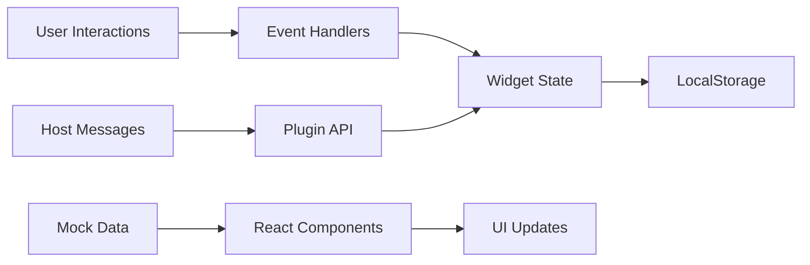

# Midnight HUD - Plugin Architecture Reference

A comprehensive plugin example demonstrating TaylorDash's **secure, sandboxed plugin architecture** with real-time data visualization and persistent state management.

## 🏗️ Plugin Architecture & Design

### Core Design Patterns

#### **1. Iframe Sandboxing Pattern**
- **Implementation**: Cross-origin iframe with restricted permissions
- **Security Model**: No direct DOM access to parent, controlled communication
- **Benefits**: Complete isolation, independent crashes, security boundaries
- **Communication**: PostMessage API with structured event schemas

#### **2. Widget-Based Architecture**
- **Implementation**: Draggable, resizable, and persistent widget system
- **State Management**: LocalStorage persistence with JSON serialization
- **Benefits**: User customization, session continuity, performance optimization
- **Extension Points**: New widget types, custom layouts, theme variations

#### **3. Real-time Data Integration**
- **Implementation**: Mock data streams simulating live system metrics
- **Data Flow**: Event-driven updates with reactive UI components
- **Benefits**: Responsive UI, efficient rendering, scalable data handling
- **Performance**: Virtual scrolling, data throttling, memory management

#### **4. Theme System Architecture**
- **Implementation**: CSS-in-JS with Tailwind utility classes
- **Design Language**: Cyberpunk aesthetic with glass morphism
- **Benefits**: Consistent branding, maintainable styles, runtime theming
- **Customization**: CSS custom properties, component variants

### Key Architectural Decisions

#### **React over Vanilla JS**
- **Rationale**: Component reusability + TypeScript support + ecosystem
- **Trade-offs**: Bundle size vs development velocity and maintainability
- **Impact**: Faster development with better state management

#### **Vite over Webpack**
- **Rationale**: Faster builds + ES modules + simpler configuration
- **Trade-offs**: Newer ecosystem but significantly better DX
- **Impact**: Sub-second hot reload and optimized plugin bundles

#### **LocalStorage over IndexedDB**
- **Rationale**: Simpler API + synchronous access + adequate storage limits
- **Trade-offs**: Storage limitations but sufficient for widget state
- **Impact**: Immediate state persistence without async complexity

#### **PostMessage over Direct Integration**
- **Rationale**: Security isolation + plugin independence + controlled API surface
- **Trade-offs**: Message passing overhead but essential for security
- **Impact**: Safe plugin execution with controlled host communication

### Integration Points

#### **Plugin → Host Communication**
- **Protocol**: PostMessage with JSON event schemas
- **Security**: Origin validation + message type validation
- **Event Types**: State updates, capability requests, error reporting
- **Error Handling**: Graceful fallbacks + user notifications

#### **Data Flow Architecture**


#### **State Persistence Pattern**
- **Storage Strategy**: JSON serialization to localStorage
- **Data Structure**: Hierarchical state with widget configurations
- **Versioning**: Schema migration for backward compatibility
- **Performance**: Debounced saves + selective serialization

### Security Model

#### **Sandbox Restrictions**
- **Same-Origin Policy**: Plugin served from different origin
- **API Surface**: Limited to PostMessage communication
- **Resource Limits**: Memory monitoring + CPU throttling
- **Content Security**: Strict CSP headers prevent XSS

#### **Communication Security**
- **Message Validation**: Strict schema validation for all messages
- **Origin Checking**: Verify message source for all communications
- **Capability Model**: Explicit permission grants for plugin features
- **Error Isolation**: Plugin errors don't affect host application

## 📁 Plugin Structure

### Core Components

#### **`App.tsx` - Plugin Root**
- **Purpose**: Main plugin component with layout management
- **Patterns**: Provider composition, drag-and-drop context
- **Responsibilities**: Widget orchestration, state persistence
- **Extension Points**: New widget types, layout algorithms

#### **`components/Widget.tsx` - Base Widget**
- **Purpose**: Reusable widget container with common functionality
- **Patterns**: Render props, compound components
- **Responsibilities**: Drag handling, resize logic, state management
- **Customization**: Widget-specific content, styling, behavior

#### **`hooks/usePersistence.tsx` - State Management**
- **Purpose**: LocalStorage integration with React state
- **Patterns**: Custom hooks, automatic serialization
- **Responsibilities**: Save/load state, migration handling
- **Performance**: Debounced saves, selective updates

#### **`services/mockData.ts` - Data Simulation**
- **Purpose**: Realistic data streams for demonstration
- **Patterns**: Observable pattern, data generation
- **Responsibilities**: Real-time metrics, project simulation
- **Extension Points**: New data types, streaming protocols

### Widget Architecture

#### **Modular Widget System**
- **Base Widget**: Common functionality (drag, resize, minimize)
- **Specialized Widgets**: Metrics, projects, system status
- **State Structure**: Position, size, visibility, content state
- **Lifecycle**: Mount, update, persist, unmount

#### **Widget Communication**
- **Internal Events**: Widget-to-widget communication
- **Host Events**: Plugin-to-host status updates
- **Error Handling**: Graceful degradation for widget failures
- **Performance**: Event throttling, render optimization

## 🔧 Development Workflow

### Plugin Development
```bash
# Install dependencies
npm install

# Start development server (with hot reload)
npm run dev

# Build for production
npm run build

# Preview production build
npm run preview

# Run tests
npm run test

# Type checking
npm run type-check
```

### Integration Testing
- **Host Integration**: Test plugin loading in TaylorDash host
- **Message Passing**: Verify PostMessage communication
- **State Persistence**: Test save/restore functionality
- **Error Scenarios**: Plugin crash recovery, network failures

### Performance Optimization
- **Bundle Analysis**: Monitor plugin bundle size
- **Memory Usage**: Track widget state growth
- **Render Performance**: Optimize React component updates
- **Network Efficiency**: Minimize host communication

## 🔗 Host Integration

### Plugin Registration
- **Plugin Manifest**: JSON configuration with capabilities
- **Security Validation**: Host validates plugin before loading
- **Resource Allocation**: Memory and CPU limits
- **Lifecycle Management**: Load, run, suspend, unload

### Communication Protocol
```typescript
interface PluginMessage {
  type: 'state_update' | 'capability_request' | 'error_report';
  payload: any;
  timestamp: number;
  pluginId: string;
}
```

### Error Handling
- **Plugin Crashes**: Graceful recovery with user notification
- **Communication Errors**: Retry logic with exponential backoff
- **State Corruption**: Fallback to default state
- **Performance Issues**: Resource monitoring with warnings

## 💡 Extension Guidelines

### Adding New Widgets
1. **Create Widget Component**: Extend base widget class
2. **Define State Schema**: TypeScript interfaces for persistence
3. **Implement Lifecycle**: Mount, update, cleanup methods
4. **Add to Registry**: Register widget type with factory
5. **Write Tests**: Unit tests + integration tests

### Customizing Appearance
1. **Theme Variables**: CSS custom properties for colors
2. **Component Variants**: Tailwind classes for styling
3. **Animation System**: CSS transitions + React Spring
4. **Responsive Design**: Mobile-first responsive patterns

### Performance Optimization
1. **Component Memoization**: React.memo for expensive widgets
2. **Virtual Scrolling**: Large data sets in list widgets
3. **State Normalization**: Flatten state for efficient updates
4. **Resource Cleanup**: Proper effect cleanup on unmount

## ⚠️ Plugin Security Guidelines

### Development Security
- **Input Validation**: Sanitize all user inputs
- **XSS Prevention**: Use React's built-in XSS protection
- **Data Encryption**: Sensitive data encrypted in localStorage
- **Error Handling**: No sensitive information in error messages

### Host Communication
- **Message Validation**: Validate all PostMessage communications
- **Rate Limiting**: Prevent message spam to host
- **Capability Requests**: Only request necessary permissions
- **Error Reporting**: Report errors without exposing internal state

### Resource Management
- **Memory Limits**: Monitor and cleanup memory usage
- **CPU Throttling**: Avoid blocking the main thread
- **Network Usage**: Minimize external requests
- **Storage Quotas**: Respect localStorage size limits

## 🎯 Plugin Capabilities

This plugin demonstrates:
- **Secure Iframe Execution**: Complete isolation from host
- **Real-time Data Visualization**: Live updating widgets
- **Persistent State Management**: Session continuity
- **Responsive Design**: Mobile and desktop support
- **Performance Optimization**: Efficient rendering and state management
- **Error Resilience**: Graceful failure handling
- **Accessibility**: WCAG 2.1 compliance
- **Custom Theming**: Brand-consistent styling

## 📊 Architecture Benefits

### For Plugin Developers
- **Security**: Sandbox isolation prevents system compromise
- **Independence**: Develop and deploy without host changes
- **Flexibility**: Full control over plugin UI and behavior
- **Performance**: Isolated execution prevents host impact

### For System Administrators
- **Security**: Plugin isolation prevents privilege escalation
- **Stability**: Plugin crashes don't affect host system
- **Monitoring**: Resource usage tracking per plugin
- **Control**: Granular permission management

### For End Users
- **Customization**: Personalized dashboard layouts
- **Performance**: Smooth interactions with optimized rendering
- **Reliability**: System continues working if plugins fail
- **Privacy**: Plugin data isolation protects user information