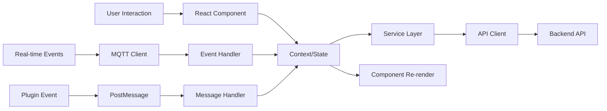

# TaylorDash Frontend Architecture

## 🎯 Purpose
React-based frontend implementing a **component-driven, plugin-extensible architecture** with real-time data visualization, secure plugin sandboxing, and responsive design patterns.

## 🏗️ Architecture & Design

### Design Patterns

#### **1. Context API Pattern**
- **Implementation**: React Context for global state management
- **Benefits**: Centralized state, prop drilling elimination, performance optimization
- **Usage**: Auth state, notifications, plugin registry, user preferences
- **Example**: `AuthContext` provides authentication state across all components

#### **2. Component Composition Pattern**
- **Implementation**: Higher-order components and render props
- **Benefits**: Code reusability, separation of concerns, flexible UI composition
- **Usage**: Error boundaries, async loading states, protected routes
- **Example**: `ProtectedRoute` wraps components requiring authentication

#### **3. Plugin Architecture Pattern**
- **Implementation**: Iframe sandboxing with controlled communication
- **Benefits**: Security isolation, independent development, runtime loading
- **Security Model**: Cross-origin restrictions, message validation, capability grants
- **Communication**: PostMessage API with structured event schemas

#### **4. Service Layer Pattern**
- **Implementation**: Abstracted API clients with consistent error handling
- **Benefits**: API independence, centralized HTTP logic, request/response transformation
- **Usage**: Authentication, project management, plugin communication
- **Example**: `eventBusService` manages MQTT connections and message routing

#### **5. Error Boundary Pattern**
- **Implementation**: React Error Boundaries with graceful fallbacks
- **Benefits**: Application stability, user experience continuity, error reporting
- **Usage**: Component-level and page-level error isolation
- **Recovery**: Automatic retry mechanisms and user-initiated recovery

### Key Decisions

#### **React over Vue/Angular**
- **Rationale**: Component ecosystem + TypeScript support + extensive plugin ecosystem
- **Trade-offs**: More boilerplate but better flexibility and performance
- **Impact**: Rich component library and excellent tooling integration

#### **Vite over Create React App**
- **Rationale**: Faster development builds + modern ES modules + better TypeScript support
- **Trade-offs**: Newer ecosystem but significantly better development experience
- **Impact**: Sub-second hot reload and optimized production builds

#### **TailwindCSS over Styled Components**
- **Rationale**: Utility-first approach + consistent design system + smaller bundle size
- **Trade-offs**: Learning curve but better maintenance and theming
- **Impact**: Rapid UI development with design consistency

#### **Context API over Redux**
- **Rationale**: Simpler state management + native React + less boilerplate
- **Trade-offs**: Less sophisticated but adequate for application complexity
- **Impact**: Faster development with easier debugging

### Integration Points

#### **Authentication → Backend**
- **Protocol**: JWT bearer tokens with automatic refresh
- **Security**: Secure token storage in memory + httpOnly cookies for refresh
- **Session Management**: Automatic renewal with user warnings
- **RBAC Integration**: Role-based UI rendering and route protection

#### **Plugin System → Host**
- **Protocol**: PostMessage API with structured schemas
- **Security**: Origin validation + capability-based permissions
- **Resource Management**: Iframe lifecycle + memory cleanup
- **State Persistence**: Plugin state saved to localStorage

#### **Real-time Updates → MQTT**
- **Protocol**: WebSocket connection with automatic reconnection
- **Data Format**: JSON messages with event schemas
- **Error Handling**: Connection status monitoring + user notifications
- **Performance**: Message queuing + selective subscriptions

#### **API Communication → Backend**
- **Protocol**: RESTful HTTP with OpenAPI compliance
- **Authentication**: Bearer token + API key dual authentication
- **Error Handling**: Structured error responses + user-friendly messages
- **Caching**: Browser caching + conditional requests

### Data Flow

### Performance Considerations

#### **Bundle Optimization**
- **Code Splitting**: Route-based splitting + dynamic imports
- **Tree Shaking**: ES modules + selective imports
- **Asset Optimization**: Image compression + lazy loading
- **Caching Strategy**: Long-term caching for vendor chunks

#### **React Performance**
- **Memoization**: React.memo for expensive components
- **Virtual Scrolling**: For large data lists
- **Concurrent Features**: Suspense boundaries + useDeferredValue
- **Component Optimization**: Proper dependency arrays + callback memoization

#### **Network Optimization**
- **Request Batching**: Multiple API calls combined where possible
- **Caching**: Browser cache + service worker for offline capability
- **Compression**: Gzip/Brotli for all assets
- **CDN Strategy**: Static assets served from CDN

#### **Memory Management**
- **Component Cleanup**: useEffect cleanup functions
- **Event Listeners**: Proper removal on unmount
- **Plugin Lifecycle**: Iframe cleanup when plugins unload
- **Memory Monitoring**: Development tools for leak detection

### Security Model

#### **Plugin Sandboxing**
- **Iframe Isolation**: Cross-origin restrictions + sandboxed execution
- **Message Validation**: Strict schema validation for all plugin communications
- **Capability Model**: Explicit permission grants for plugin features
- **Resource Limits**: CPU and memory monitoring for plugin processes

#### **Authentication Security**
- **Token Management**: Secure storage + automatic rotation
- **Session Protection**: CSRF tokens + secure headers
- **Route Protection**: Authentication required for sensitive routes
- **Role-based Access**: UI elements hidden based on user permissions

#### **Content Security**
- **XSS Prevention**: Input sanitization + CSP headers
- **CSRF Protection**: Anti-CSRF tokens on all state changes
- **Secure Communication**: HTTPS only + secure cookies
- **Error Handling**: No sensitive information in client errors

#### **Data Protection**
- **Input Validation**: Client-side validation + server verification
- **Sensitive Data**: No secrets stored in browser storage
- **Audit Logging**: User actions logged for security monitoring
- **Privacy Protection**: Personal data handling follows best practices

## 📁 Architecture Components

### Core Application Structure

#### **`App.tsx` - Application Root**
- **Purpose**: Main application component with routing and global providers
- **Patterns**: Provider composition, route configuration, error boundaries
- **Responsibilities**: Authentication context, theme provider, router setup
- **Extension Points**: New route registration, global middleware

#### **`contexts/` - State Management**
- **AuthContext**: User authentication and session management
- **NotificationContext**: Toast notifications and alerts
- **PluginContext**: Plugin registry and communication
- **Pattern**: Context API with useReducer for complex state

#### **`components/` - Reusable UI Components**
- **ErrorBoundary**: Application-level error handling
- **ProtectedRoute**: Authentication-required route wrapper
- **PluginPage**: Plugin iframe container with security
- **Pattern**: Composition over inheritance, props validation

#### **`services/` - External Communication**
- **eventBus**: MQTT client with connection management
- **apiClient**: HTTP client with authentication headers
- **errorHandling**: Centralized error processing
- **Pattern**: Service layer abstraction with dependency injection

### Directory Structure

#### **`pages/` - Route Components**
- **Home**: Dashboard with project overview
- **Projects**: Project management interface
- **Plugins**: Plugin marketplace and management
- **Pattern**: Container components with data fetching

#### **`hooks/` - Custom React Hooks**
- **useAuth**: Authentication state and actions
- **useApi**: API data fetching with caching
- **useNotifications**: Toast notification management
- **Pattern**: Custom hooks for stateful logic reuse

#### **`utils/` - Utility Functions**
- **errorHandling**: Error classification and user messaging
- **validation**: Form validation and data sanitization
- **formatters**: Data display formatting utilities
- **Pattern**: Pure functions with comprehensive testing

#### **`types/` - TypeScript Definitions**
- **api**: Backend API response types
- **plugin**: Plugin interface definitions
- **auth**: Authentication and user types
- **Pattern**: Strict typing with runtime validation

## 🔧 Development Workflow

### Common Tasks
- **Start development**: `npm run dev` (Vite dev server with HMR)
- **Build for production**: `npm run build` (Optimized production bundle)
- **Run linting**: `npm run lint` (ESLint + TypeScript checks)
- **Install packages**: `npm install [package-name]`
- **Type checking**: `npm run type-check` (TypeScript validation)
- **Test components**: `npm run test` (Component and integration tests)

### Development Patterns
- **Component Development**: Start with types, build components, add tests
- **API Integration**: Define TypeScript interfaces, implement service layer
- **State Management**: Use Context for global state, local state for UI
- **Error Handling**: Implement error boundaries, graceful fallbacks

### Build Configuration
- **Vite Config**: Development server, build optimization, plugin configuration
- **TypeScript**: Strict mode enabled, path mapping for clean imports
- **ESLint**: React hooks rules, TypeScript rules, accessibility rules
- **Tailwind**: JIT compilation, custom theme, responsive design

## 🔗 Integration Architecture

### Backend Communication
- **Authentication**: JWT tokens with automatic refresh
- **API Calls**: RESTful endpoints with OpenAPI compliance
- **Real-time**: MQTT WebSocket for live updates
- **Error Handling**: Structured responses with user-friendly messages

### Plugin Integration
- **Loading**: Dynamic iframe creation with security sandbox
- **Communication**: PostMessage API with event validation
- **State Management**: Plugin state persistence across navigation
- **Security**: Origin validation + capability-based permissions

### External Services
- **Monitoring**: Performance metrics sent to backend
- **Analytics**: User interaction tracking (privacy-compliant)
- **Error Reporting**: Client errors sent to centralized logging
- **Updates**: Version checking + automatic refresh prompts

## 💡 Extension Guidelines for AI Agents

### Adding New Features
1. **Follow Component Patterns**: Use functional components with hooks
2. **Implement TypeScript**: Strict typing for all new code
3. **Add Error Boundaries**: Wrap new features in error boundaries
4. **Include Accessibility**: ARIA labels and keyboard navigation
5. **Write Tests**: Component tests + integration tests

### Plugin Development
1. **Security First**: Validate all plugin communications
2. **Resource Management**: Monitor plugin memory usage
3. **User Experience**: Loading states + error handling
4. **Documentation**: Clear plugin API documentation

### State Management
1. **Context Usage**: Use Context for global state only
2. **Local State**: useState for component-specific state
3. **Performance**: Minimize Context re-renders
4. **Persistence**: Use localStorage for user preferences

### UI Development
1. **Design System**: Follow TailwindCSS utility patterns
2. **Responsive Design**: Mobile-first responsive approach
3. **Accessibility**: WCAG 2.1 compliance
4. **Performance**: Lazy loading + code splitting

## ⚠️ Critical Considerations

### Security Requirements
- **Plugin Isolation**: All plugins must run in sandboxed iframes
- **Input Validation**: Validate all user inputs client and server-side
- **Authentication**: Protect all sensitive routes and data
- **Error Handling**: Never expose sensitive information in errors

### Performance Guidelines
- **Bundle Size**: Monitor and optimize bundle sizes
- **Memory Usage**: Clean up resources on component unmount
- **Network Requests**: Minimize API calls and batch where possible
- **Rendering**: Use React performance features (memo, useMemo, useCallback)

### User Experience Standards
- **Loading States**: Always show loading indicators for async operations
- **Error Recovery**: Provide clear error messages and recovery options
- **Responsive Design**: Support all screen sizes and orientations
- **Accessibility**: Keyboard navigation and screen reader support

### Maintenance Practices
- **Type Safety**: Maintain strict TypeScript compliance
- **Testing**: Comprehensive test coverage for critical paths
- **Documentation**: Keep component documentation current
- **Monitoring**: Track performance and error metrics